# Section 5 Working with Files and Flows 

Table of Contents

- [Section 5 Working with Files and Flows](#section-5-working-with-files-and-flows)
  - [Input / Output Streams](#input--output-streams)
  - [Command Sequences](#command-sequences)
  - [Regular Expressions](#regular-expressions)
  - [Advanced File Techniques \& Data Extraction](#advanced-file-techniques--data-extraction)
  - [Extract Data](#extract-data)
  - [Screen Editors](#screen-editors)
  - [SUDO Management](#sudo-management)


<br>
<br>


## Input / Output Streams

<h3>Standard File Descriptors. Redirection</h3>

[⬆ Back to top](#top)

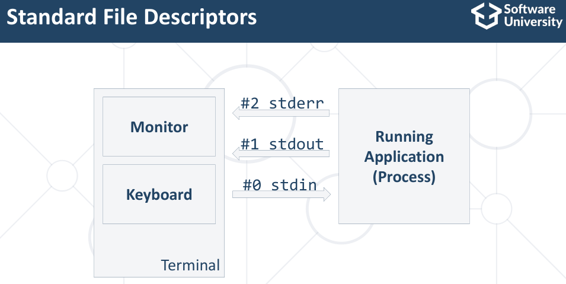
<br>
<br>

<strong>Redirect Input (<)</strong>

- Description
  - Redirect input stream (stdin). Usually, it is omitted
- Example
  - [user@host ~]$ cat < hello.txt
  - result: Hello!
  - [user@host ~]$ cat hello.txt
  - result: Hello!


<strong>Redirect Output (>)</strong>

- Description
  - Redirect output streams (stdout or stderr) with target overwrite
- Example
  - [user@host ~]$ echo 'Hello!' > hello.txt
  - [user@host ~]$ echo 'Hello!' 1> hello.txt
  - [user@host ~]$ cat hello.txt
  - result: Hello!


<strong>Redirect Output with Append (>>)</strong>

- Description
  - Redirect output streams (stdout or stderr) with target append
- Example
  - [user@host ~]$ cat file.txt
  - Line #1
  - [user@host ~]$ echo 'Line #2' >> file.txt
  - [user@host ~]$ cat file.txt
  - Line #1
  - Line #2


<strong>Set -/+o Noclobber</strong>

- Description
  - (Dis)allow existing regular files to be overwritten by redirection
- Example
  - [user@host ~]$ set -o noclobber
  - [user@host ~]$ echo 'Hi!' > file.txt
  - [user@host ~]$ echo 'Hi!' > file.txt
  - bash: file.txt: existing file cannot be overwritten
  - [user@host ~]$


<strong>Redirection Order</strong>

- Order is important
  - Redirection instructions are processed left to right
- Example
  - [user@host ~]$ cat missing.txt > out.txt 2>&1
    - save output to file and error output to same file
  - is different compared to this
  - [user@host ~]$ cat missing.txt 2>&1 > out.txt
    - set error to console output and save console output to file


<strong>Redirection Recipes</strong>

- Only stdout
  - [user@host ~]$ ls -alF > dir_list.txt
- Both stdout and stderr – different targets
  - [user@host ~]$ ls -al file.txt > ok.txt 2> err.txt
- Both stdout and stderr – same target
  - [user@host ~]$ ls -al file.txt > res.txt 2>&1


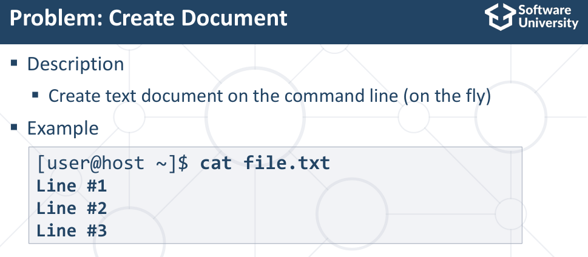
<br>
<br>

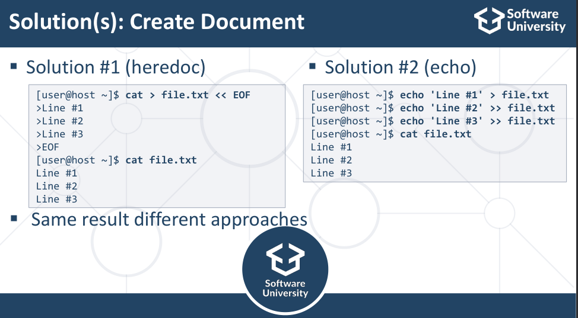
<br>
<br>

[⬆ Back to top](#top)


## Command Sequences

[⬆ Back to top](#top)

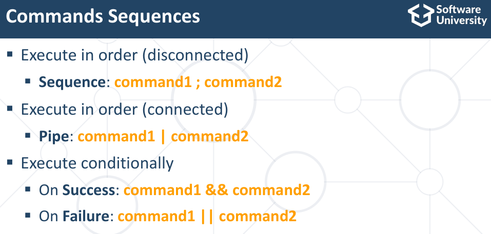
<br>
<br>

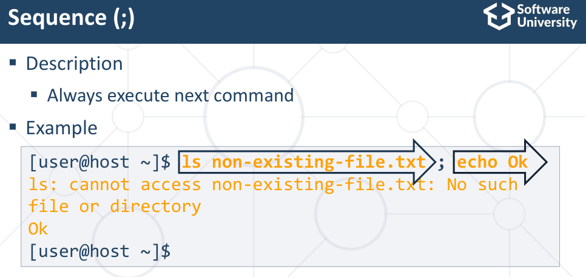
<br>
<br>

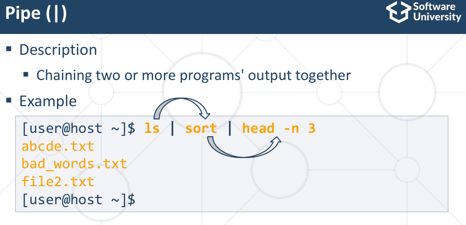
<br>
<br>

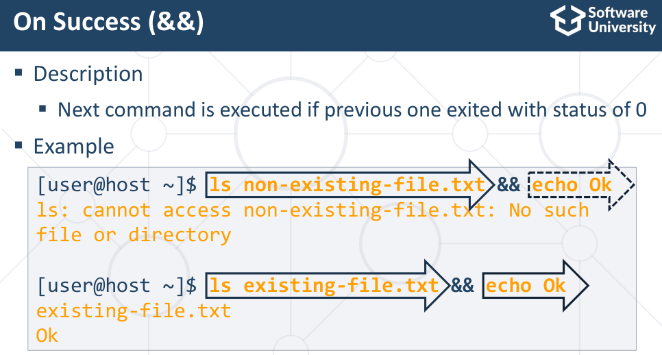
<br>
<br>

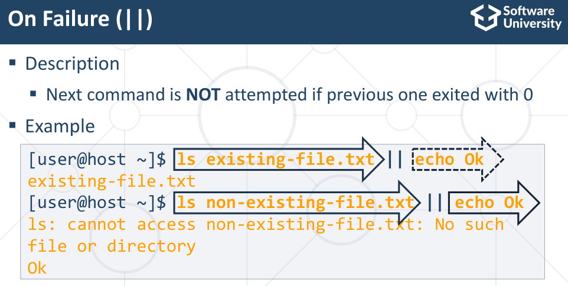
<br>
<br>


<strong>Command Substitution</strong>

- Description
  - Substitute the command output for the command itself
- Example
  - file_name.txt contains the text /etc/os-release
    - [user@host ~]$ cat `cat file_name.txt`
    - [user@host ~]$ cat $(cat file_name.txt)


<strong>Breaking Long Commands</strong>

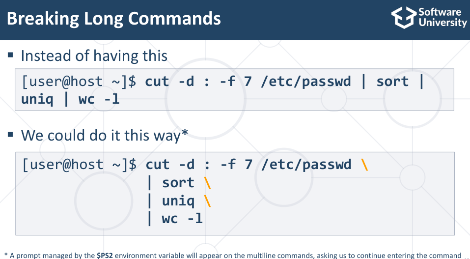
<br>
<br>

<strong>tee</strong>

- Purpose
  - Read from standard input and write to standard output and files
- Syntax
  - tee [options] [file]
- Examples
  - Show file content on screen and save it to file
    - [user@host ~]$ cat list.txt | tee listed.txt
  - List directory on the screen and append to file
    - [user@host ~]$ ls -al / | tee -a root-dir.txt


<strong>xargs</strong>

- Purpose
  - Build and execute command lines from standard input
- Syntax
  - xargs [options] [command [initial arguments]]
- Examples
  - Delete list of files read from a text file
    - [user@host ~]$ cat file_list.txt | xargs rm –rf
  - Show file content of every *.conf file in /etc
    - [user@host ~]$ ls /etc/*.conf | xargs cat


<h3>Practice</h3>

<strong>Redirect different status codes in different files</strong>

[user@host ~]$ ls -l ~ /missing > ls-stdout.txt 2> ls-stderr.txt

List home dir (~) and try to list missing dir (/missing)
  - save success result in ls-stdout.txt file
  - save error result in ls-stderr.txt file


<strong>Redirect different status codes in the same file</strong>

[user@host ~]$ ls -l ~ /absent > ls-mixed.txt 2>&1

List home dir (~) and try to list missing dir (/absent)
  - save success result in ls-mixed.txt file
  - save error result in the same file as success result

<strong>Print status on the console and redirect in file</strong>

Case 1 - no console print
[user@host ~]$ ls -l ~ /absent > ls-out.txt 2>&1
  - save success and error text in file ls-out.txt

Case 1 - console print and then save to file
[user@host ~]$ ls -l ~ /absent 2>&1 > ls-out.txt 
  - print status codes on th econsole and then save them in file ls-out.txt

<strong>Print text on the console and save it to file - Substitute</strong>

Case 1 - using backticks to add command
```bash
[user@host ~]$ echo 'Current date is' `date` > date.txt
```

Case 2 - using $ to add command
```bash
[user@host ~]$ echo 'Current date is' $(date) > date.txt
```

  - Subcase 1 - if we use single bracket the additional command do not work
```bash
[user@host ~]$ echo 'Current date is $(date)' > date.txt
[user@host ~]$ cat date.txt
# result: Current date is $(date)
```

  - Subcase 2 - if we use double bracket the additional command works
```bash
[user@host ~]$ echo "Current date is $(date)" > date.txt
[user@host ~]$ cat date.txt
# result: Current date is Mon Mar 24 14:45:47 EET 2026
```

Case 3 - create file with tabs and we want to know what are the empty spaces - tabs or spaces.
```bash
[user@host ~]$ echo -e 'File with one\tand\t\ttwo tabs.' > file-w-tabs.txt
# -e allow us to use \t as tab
[user@host ~]$ cat file-w-tabs.txt
# result: File with one   and      two tabs.
```

Print the tabs as special characters if different than space
```bash
[user@host ~]$ cat -vET file-w-tabs.txt
# result: File with one^Iand^I^Itwo tabs.
```

Case 4 - consequence of commands - mixed
```bash
[user@host ~]$ ls ls* && ls missing.txt || echo 'Executed'
# result: 
file1.txt file2.txt file3.txt
ls: cannot access 'missing.txt': No such file or directory
Executed
```

Case 4 - tee - print result on console and save it in a file
```bash
[user@host ~]$ ls -l | tee tee-out.txt
# result: 
list of the dir

[user@host ~]$ cat tee-out.txt
# result: 
list of the dir
```

Case 5 - xargs - we can use file with text for commands attributes

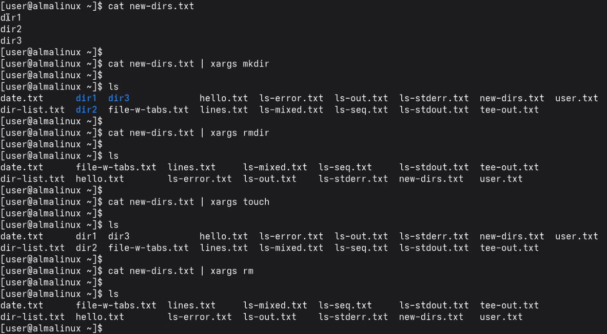
<br>
<br>


[⬆ Back to top](#top)


## Regular Expressions

[⬆ Back to top](#top)


<br>
<br>

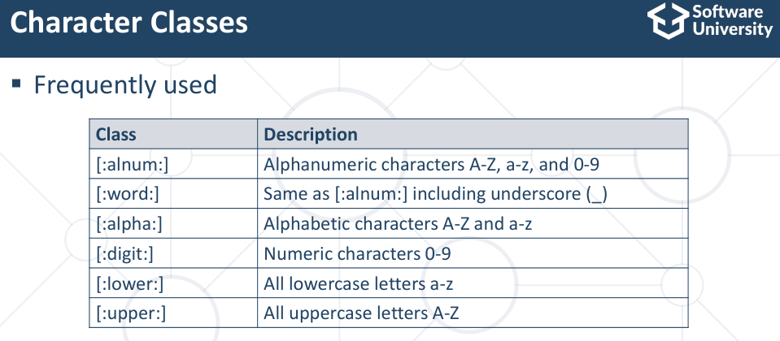
<br>
<br>


<br>
<br>

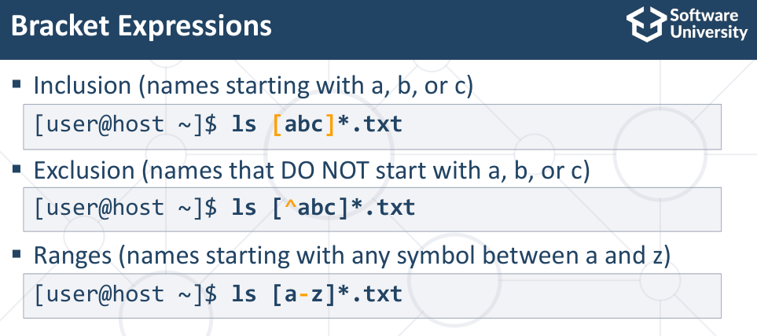
<br>
<br>


<br>
<br>


<br>
<br>


<br>
<br>


<strong>grep</strong>

- Purpose
  - Print lines matching a pattern    
- Syntax
  - grep [options] patterns [files]   
- Examples
  - Display lines containing the false word #1
    - [user@host ~]$ grep -n false /etc/passwd    
  - Display lines containing the false word #2
    - [user@host ~]$ cat /etc/passwd | grep -n false


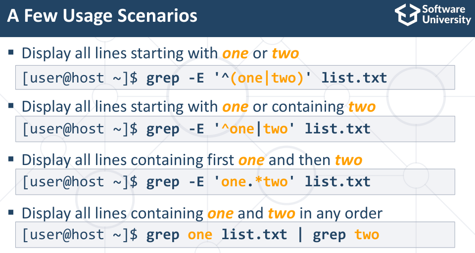
<br>
<br>

[⬆ Back to top](#top)


## Advanced File Techniques & Data Extraction

[⬆ Back to top](#top)

<strong>find</strong>

- Purpose
  - Search for files in a directory hierarchy   
- Syntax
  - find [options] [starting point] [expression]      
- Examples
  - Find all *.txt files starting from current dir
    - [user@host ~]$ find . -type f -name *.txt       
  - Search for files executable by others
    - [user@host ~]$ find . -type f -perm /o+x    


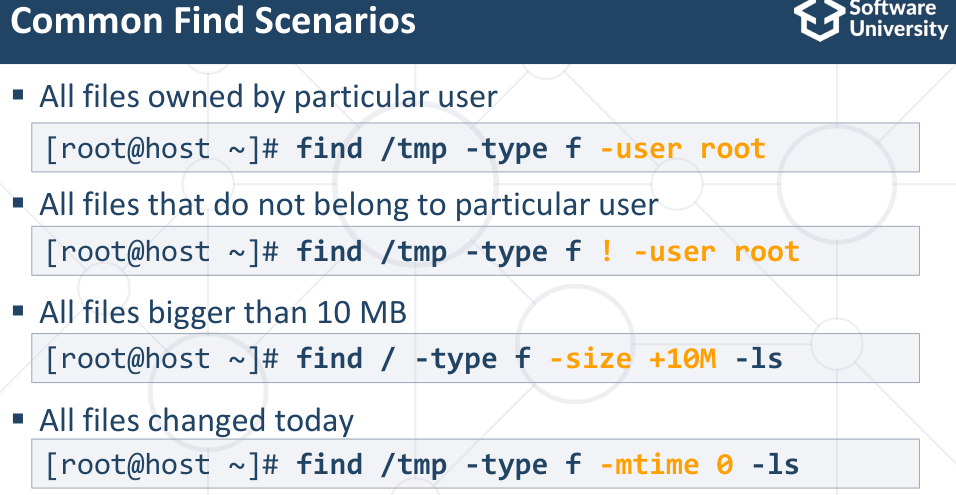
<br>
<br>

<strong>locate*</strong>

- Purpose
  - Find files by name      
- Syntax
  - locate [options] pattern      
- Examples
  - Locate all readme files
    - [root@host ~]# locate readme      
  - Locate all readme files in a case insensitive way
    - [root@host ~]# locate -i readme    


<strong>updatedb*</strong>

- Purpose
  - Update a database for mlocate      
- Syntax
  - updatedb [options]      
- Examples
  - Update the database
    - [root@host ~]# updatedb      
  - Write the update to a file
    - [root@host ~]# updatedb -o output.txt 


[⬆ Back to top](#top)

## Extract Data

[⬆ Back to top](#top)


<strong>more</strong>

- Purpose
  - A filter for paging through text one screen at a time      
- Syntax
  - more [options] [files]      
- Examples
  - Open one file for reading
    - [user@host ~]$ more /etc/services      
  - Open two files for reading
    - [user@host ~]$ more /etc/os-release /etc/services


<strong>less*</strong>

- Purpose
  - It is similar to more, but allows movement in both directions      
- Syntax
  - less [options] [files]      
- Examples
  - Open one file for reading
    - [user@host ~]$ less /etc/services     
  - Open two files for reading
    - [user@host ~]$ less /etc/os-release /etc/services


<strong>head</strong>

- Purpose
  - Output the first part (10 lines by default) of files     
- Syntax
  - head [options] [files]      
- Examples
  - Show first ten lines of a file
    - [user@host ~]$ head /etc/passwd    
  - Show first three lines of a file
    - [user@host ~]$ head -n 3 /etc/passwd


<strong>tail</strong>

- Purpose
  - Output the last part (10 lines by default) of files       
- Syntax
  - tail [options] [files]      
- Examples
  - Show last ten lines of a file
    - [user@host ~]$ tail /etc/passwd    
  - Show last three lines of a file
    - [user@host ~]$ tail -n 3 /etc/passwd


<strong>tac</strong>

- Purpose
  - Concatenate and print files in reverse       
- Syntax
  - tac [options] [files]      
- Examples
  - Print one file in reverse
    - [user@host ~]$ tac readme.txt   
  - Print /etc/*.conf files in reverse
    - [user@host ~]$ tac /etc/*.conf

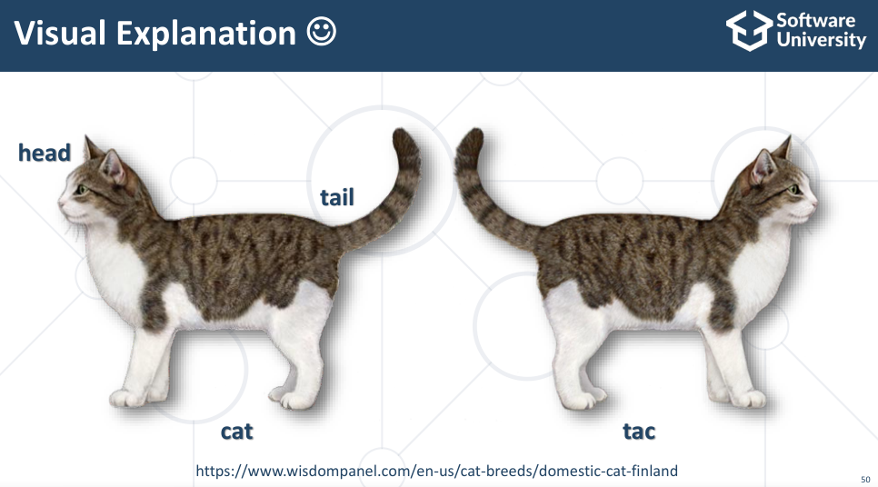
<br>
<br>


<strong>uniq</strong>

- Purpose
  - Report or omit consequent repeated lines       
- Syntax
  - uniq [options] [files]      
- Examples
  - Print only duplicate lines
    - [user@host ~]$ uniq -D file.txt  
  - Print contents with repeated lines omitted
    - [user@host ~]$ uniq file.txt


<strong>sort</strong>

- Purpose
  - Sort lines of text files      
- Syntax
  - sort [options] [files]      
- Examples
  - Print sorted content of a file
    - [user@host ~]$ sort file.txt  
  - Print sorted only unique lines of a file
    - [user@host ~]$ sort -u file.txt


<strong>wc</strong>

- Purpose
  - Print newline, word, and byte counts for each file      
- Syntax
  - wc [options] [files]      
- Examples
  - Print statistics for a file
    - [user@host ~]$ wc /etc/service  
  - Print number of newlines in a file
    - [user@host ~]$ wc -l /etc/service


<strong>nl</strong>

- Purpose
  - Add number to the beginning of every line in a file     
- Syntax
  - nl [options] [files]      
- Examples
  - Print numbered lines read from a file
    - [user@host ~]$ nl /etc/service  
  - Print numbered lines with leading zeroes
    - [user@host ~]$ nl -w 4 -nrz /etc/service


<strong>cut</strong>

- Purpose
  - Print newline, word, and byte counts for each file. Files must be with structure.      
- Syntax
  - cut options [files]      
- Examples
  - Cut field #1 (username) from /etc/passwd
    - [user@host ~]$ cut -d : -f 1 /etc/passwd    
  - Cut fields #1 and #7 from /etc/passwd
    - [user@host ~]$ cut -d : -f 1,7 /etc/passwd


<strong>paste</strong>

- Purpose
  - Merge lines of files from files without setting - 1st line with 1st line, 2nd line with 2nd line      
- Syntax
  - paste [options] [files]      
- Examples
  - Merge two files
    - [user@host ~]$ paste day_num.txt day_name.txt  


<strong>join</strong>

- Purpose
  - Join lines of two files on a common field. We set the lines that are joining from file1 and file2. The files must me structured.        
- Syntax
  - join [options] file1 file2      
- Examples
  - Join two files
    - [user@host ~]$ join -t : -j 1 f1.txt f2.txt 


<strong>split</strong>

- Purpose
  - Split a file into pieces      
- Syntax
  - split [options] [input [prefix]]    
- Examples
  - Split file in multiple files 50 lines each
    - [user@host ~]$ split -l 50 services  
  - Split file in multiple files 50 lines each #2
    - [user@host ~]$ split -a 3 –d -l 50 services part


<strong>expand</strong>

- Purpose
  - Convert tabs to spaces       
- Syntax
  - expand [options] [files]      
- Examples
  - Convert tabs to four spaces each
    - [user@host ~]$ expand -t 4 file.txt 


<strong>unexpand</strong>

- Purpose
  - Convert spaces to tabs     
- Syntax
  - unexpand [options] [files]      
- Examples
  - Convert every four spaces to tab
    - [user@host ~]$ unexpand -t 4 file.txt 


<strong>fmt</strong>

- Purpose
  - Provides simple text formatting      
- Syntax
  - fmt [options] [files]      
- Examples
  - Format the text to 60 columns
    - [user@host ~]$ fmt --width 60 file.txt  


<strong>tr</strong>

- Purpose
  - Translate or delete characters. It works only with stdin.      
- Syntax
  - tr [options] set1 [set2]      
- Examples
  - Convert every : to |
    - [user@host ~]$ tr ':' '|' < /etc/passwd 
  - Delete all occurrences of :
    - [user@host ~]$ tr -d ':' < /etc/passwd


<strong>od</strong>

- Purpose
  - Dump files in octal or other formats      
- Syntax
  - od [options] [files]      
- Examples
  - Print file’s content in octal format
    - [user@host ~]$ od /etc/passwd 
  - Print file’s content using named characters
    - [user@host ~]$ od -a /etc/passwd


<h3>Practice</h3>

Case 1 - using grep with files

Subcase 1 - using grep directly on one file
```bash
[user@host ~]$ grep bash users.txt
# result:
root:x:0:0:Super User:/root:/bin/bash
user:x:1000:1000:Regular User:/home/user:/bin/bash
```

Subcase 2 - using grep directly on multiple files
```bash
[user@host ~]$ grep bash users.txt /etc/passwd
# result:
users.txt:root:x:0:0:Super User:/root:/bin/bash
users.txt:user:x:1000:1000:Regular User:/home/user:/bin/bash
/etc/passwd:root:x:0:0:Super User:/root:/bin/bash
/etc/passwd:user:x:1000:1000:Regular User:/home/user:/bin/bash
```

Subcase 3 - using grep with commands - same result as used on one file
```bash
[user@host ~]$ cat users.txt | grep bash 
# result:
root:x:0:0:Super User:/root:/bin/bash
user:x:1000:1000:Regular User:/home/user:/bin/bash
```

Subcase 4 - using grep after command on multiple files - do not show source file
```bash
[user@host ~]$ cat users.txt /etc/passwd | grep bash
# result:
root:x:0:0:Super User:/root:/bin/bash
user:x:1000:1000:Regular User:/home/user:/bin/bash
root:x:0:0:Super User:/root:/bin/bash
user:x:1000:1000:Regular User:/home/user:/bin/bash
```

Subcase 5 - use grep for search in file as starting as one letter
```bash
[user@host ~]$ grep ^r users.txt
# result:
root:x:0:0:Super User:/root:/bin/bash
```

Subcase 5 - use grep for search in file as starting as more than one letter
```bash
[user@host ~]$ grep ^[ru] users.txt
# result:
root:x:0:0:Super User:/root:/bin/bash
user:x:1000:1000:Regular User:/home/user:/bin/bash
```

Subcase 5 - use grep for search in file as ending as described
```bash
[user@host ~]$ grep sh$ users.txt
# result:
root:x:0:0:Super User:/root:/bin/bash
user:x:1000:1000:Regular User:/home/user:/bin/bash
```


Case 2 - Globing - search with wildcard

Subcase 1 - search for specific files with 4 letter name and .conf extension
```bash
[user@host ~]$ ls -al /etc/????.conf
# result:
-rw-r--r--. 1 root root    9 Nov  29  2023 /etc/host.conf
-rw-r--r--. 1 root root  880 Apr  28  2025 /etc/krb5.conf
-rw-r-----. 1 root root 4339 Jul   8  2025 /etc/sudo.conf
```

Subcase 2 - search for specific files that start with specific letters plus else
```bash
[user@host ~]$ ls -al /etc/[kst]????.conf
# result:
-rw-r--r--. 1 root root 8782 Jan 17 12:01 /etc/kdump.conf
```

Subcase 3 - search for specific files that not start with specific letters plus else
```bash
[user@host ~]$ ls -al /etc/[^kst]????.conf
# result:
-rw-r--r--. 1 root root   28 Nov 11 02:00 /etc/ld.so.conf
-rw-r--r--. 1 root root  817 Oct 29  2024 /etc/xattr.conf
```

Case 3 - Using command Find

Subcase 1 - find files with specific name
```bash
[user@host ~]$ sudo find /usr -type f -name README
# result:
...
```

Subcase 2 - find files with specific extension
```bash
[user@host ~]$ sudo find /usr -type f -name "*.conf"
# result:
...
```

Subcase 3 - find files with specific extension and owned by specific user
```bash
[user@host ~]$ sudo find / -type f -name "*.txt" -user user
# result:
...
```

Subcase 4 - find files with specific extension and NOT owned by specific user
```bash
[user@host ~]$ sudo find / -type f -name "*.txt" -not -user user
# result:
...
```

Subcase 5 - find files with specific extension that are modified in the last 24 hours
```bash
[user@host ~]$ sudo find /etc -type f -mtime 0 -name "*.conf"
# result:
...
```

Subcase 6 - find files with specific extension that are modified in the last 24 hours and execute additional command (-exec cat {}) for each found object
```bash
[user@host ~]$ sudo find /etc -type f -mtime 0 -name "*.conf" -exec cat {} \;
# result:
...
```

Subcase 7 - show statistics for specific file
```bash
[user@host ~]$ stat /etc/resolv.conf
# result:
...
```


## Screen Editors

<h3>Characteristics. vim</h3>


<br>
<br>

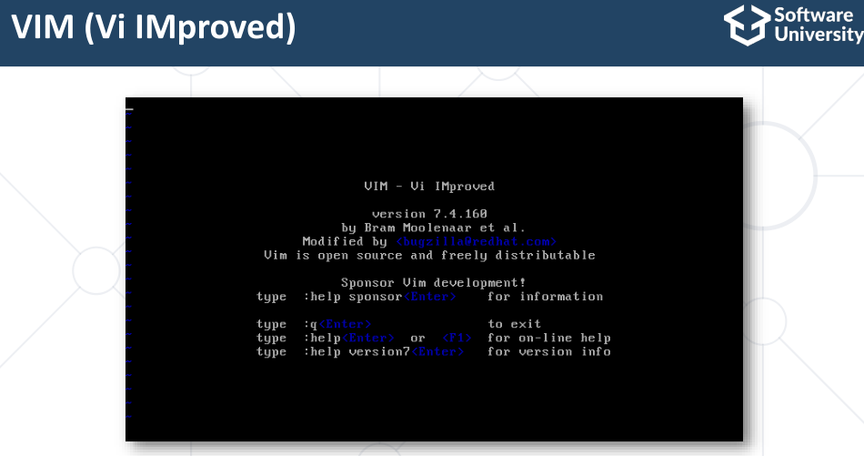
<br>
<br>


<br>
<br>

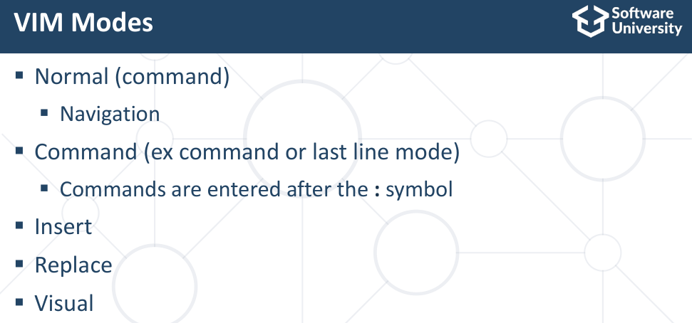
<br>
<br>

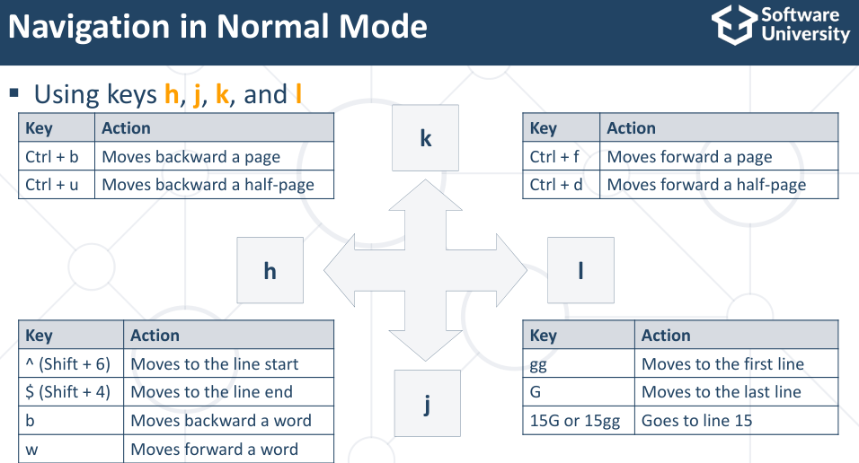
<br>
<br>


<br>
<br>


<br>
<br>

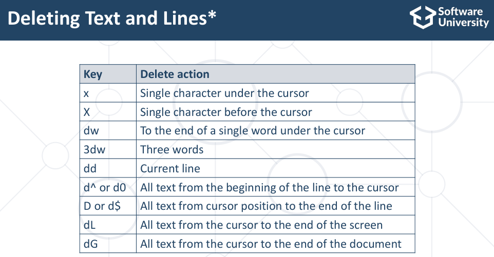
<br>
<br>

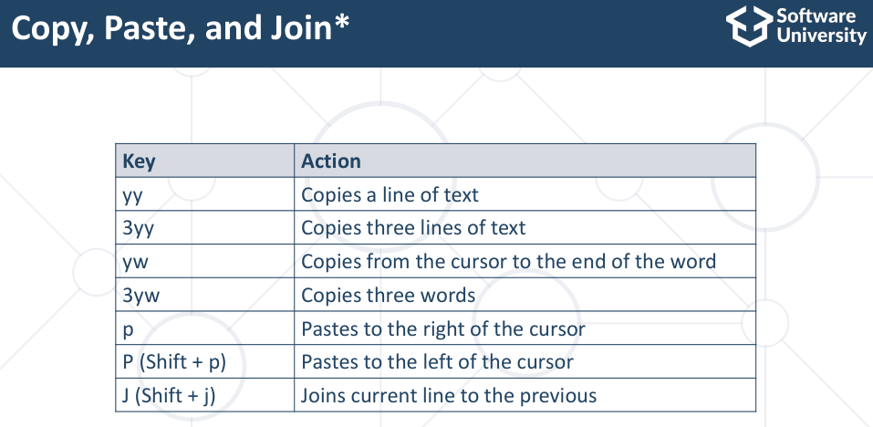
<br>
<br>

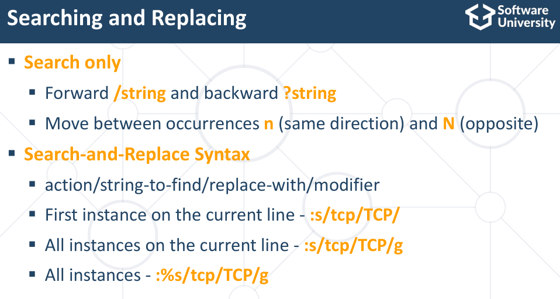
<br>
<br>


<br>
<br>


<br>
<br>


<br>
<br>

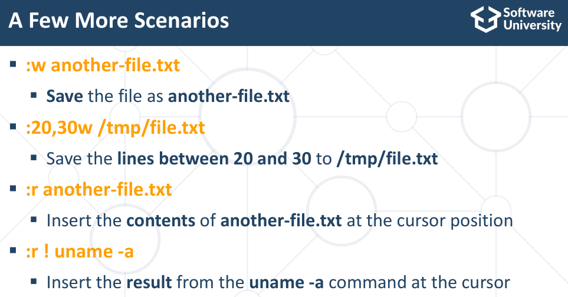
<br>
<br>


<br>
<br>


<h3>nano</h3>


<br>
<br>

<h3>sed</h3>


<br>
<br>

<strong>sed</strong>

- Description
  - Stream editor for filtering and transforming text     
- Syntax
  - od [options] [files]      
- Examples
  - [user@host ~]$ echo 'one twenty-one' | sed s/one/ONE/g
  - ONE twenty-ONE 
  - [user@host ~]$ sed s/one/ONE/g filein.txt > fileout.txt

<strong>Common Sed Scenarios #1</strong>

- Replace first instance
  - [user@host ~]$ sed s/tcp/TCP/ file.txt
- Replace all instances
  - [user@host ~]$ sed s/tcp/TCP/g file.txt
- Two consecutive search and replace operations
  - [user@host ~]$ sed 's/tcp/TCP/g ; s/TCP/UDP/g' file.txt
  - [user@host ~]$ sed -e s/tcp/TCP/g -e s/TCP/UDP/g file.txt

<strong>Common Sed Scenarios #2</strong>

- Replace pattern with spaces
  - [user@host ~]$ sed 's/is not/is too/g' file.txt
- Replace all instances, but print only the changed ones
  - [user@host ~]$ sed -n s/dns/DNS/pg /etc/services
- Search and replace in rage of lines
  - [user@host ~]$ sed -n '1,10s/dns/DNS/pg' services
- Delete comment and empty lines and create a backup
  - [user@host ~]$ sed –i.bak '/^#/d;/^$/d' services


<h3>Stream Editor awk</h3>


<br>
<br>

<strong>awk</strong>

- Description
  - Pattern scanning and processing language       
- Examples
  - print the first two fields of every line
    - [user@host ~]$ cat file.txt | awk '{print $1,$2}'
  - using different field separator
    - [user@host ~]$ cat /etc/passwd | awk -F ':' '{print $1,$7}'
  - use only lines containing the word text
    - [user@host ~]$ cat file.txt | awk '/text/ {print $1,$7}'


<h3>Other use Cases of Vim</h3>

<strong>vipw</strong>

- Description
  - Edit the passwd or shadow-password file        
- Examples
  - [root@host ~]# vipw
  - user:x:1000:1000::/home/user:/bin/bash
  - devops:x:1001:1001::/home/devops:/bin/bash
  - clerk:x:1002:1002::/home/clerk:/bin/bash

<strong>vigr</strong>

- Description
  - Edit the group or shadow-group file    
- Examples
  - [root@host ~]# vigr
  - user:x:1000:user
  - devops:x:1001:devops
  - clerk:x:1002:clerk

<strong>visudo</strong>

- Description
  - Edit the sudoers file        
- Examples
  - [root@host ~]# visudo
  - Allow root to run any commands anywhere
  - root ALL=(ALL) ALL

[⬆ Back to top](#top)


## SUDO Management

[⬆ Back to top](#top)

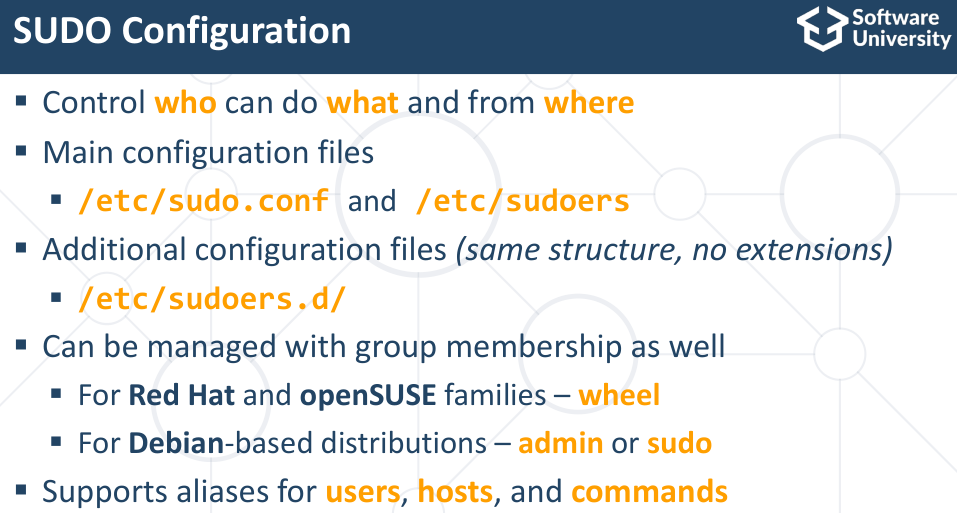
<br>
<br>

<strong>It is a good practice to add or manage not the official config files but the additional ones that append to the configuration. This way when a system update/upgrade is performed the original config files can be overwritten but the append/additional that we configure are not changed.</strong>

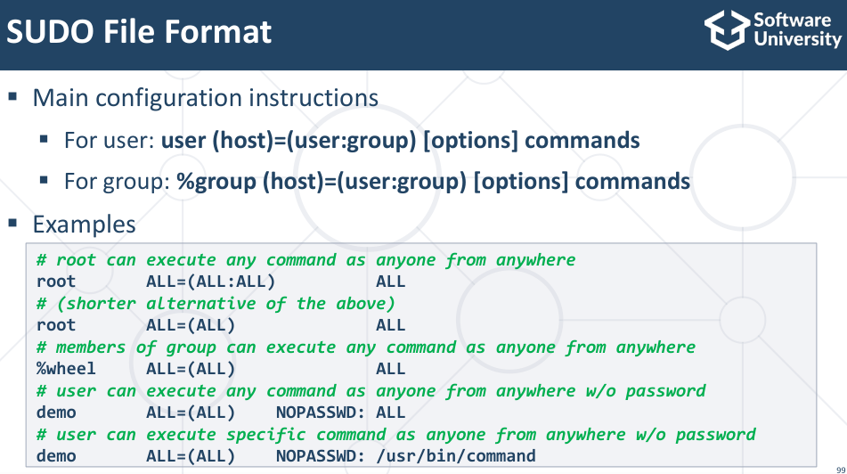
<br>
<br>

<h3>Practice</h3>

<strong>Navigation in VIM</strong>

- Open file with VIM - vi filename
- Open file to specific line (33) - vi +33 filename
- Open file on position containing specific text (VNC) - vi +/VNC filename 
- Go to the end of the file - G
- Go to the start of the file - gg
- Go to specific line (28) - 28G
- Enable line numbers - :set number
- Search pattern 1 (from the beggining of the file) - /https
  - go to next entity - n
  - go to previous entity - N
- Search pattern 2 (from the end of the file) - ?dmn
  - go to previous entity (backwords - to the start of the file) - n
  - go to next entity (to the end of the file) - N
- Search and replace - :%s/tcp/TCP/g
  - search all entities in the file - /%s
  - replace tcp with TCP - /tcp/TCP
  - replace all calues in the file - /g
- Add 4 spaces at the satrt of lines between 100 and 150 - :100,150s/^/    /
- Import content
  - Add lines from current position - i
  - Add content to current line from command - :r ! uname -a
  - Add content to current line from file - :r /etc/hostnmae 
- Undo  changes - u
- Save and Quit - :wq
- Quit VIM without saving changes - :q!
- Open multiple files
  - bash --> vi -o filename1 filename2
  - switch between files - ctrl+v
  - close both files - :qa

<strong>Navigation in nano</strong>

Install nano in alma linux    
  bash --> sudo dnf install nano

- Open file with nano - nano filename
- Open help in nano - ctrl+g
- Cut line - ctrl+k
- Paste line - ctrl+u
- Go to specific line (145) - ctrl+/145
- Search and eplace - ctrl+\
- Undo changes - alt+u

<strong>sed</strong>

- Search and change tcp to TCP in whole file (not saved just printed result) - sed s/tcp/TCP/g filename
  - use different separator if we have slash in the path
    - bash --> sed s#tcp#TCP#g filename
- Examples for search and change multiple entities in file (file not changed - just printed) 
  - bash --> sed s/tcp/TCP/g filename | sed s/udp/UDP/g
  - bash --> sed 's/tcp/TCP/g ; s/udp/UDP/g' filename
  - bash --> -e s/tcp/TCP/g -e s/udp/UDP/g filename
- Print only changes from the command (flag -n)
  - bash --> sed -n s/tcp/TCP/g filename
- Make changes in specific range
  - bash --> sed -n '600,700s/dns/DNS/pg' filename
- Remove all lines that start with # and empty lines
  - bash --> sed '/^#/d ; /^$/d' filename
- Save changes in the working file and make a copy
  - bash --> sed -i.bak '/^#/d ; /^$/d' filename
- Compaer 2 files
  - bash --> diff filename1 filename2

<strong>awk</strong>

- Print columnt 1 from file
  - bash --> cat users.txt | awk -F ':' '{print $1}'
- Print columnt 1 from file that contain 'bash'
  - bash --> cat users.txt | awk -F ':' '/bash/ {print $1}'
- Print columnt 1 from file with prefix
  - cat users.txt | awk -F ':' '{print "user:",$1}'
- Print multiple columns from file with prefix
  - awk -F ':' '{print "user:",$1,"shell",$7}' users.txt

<strong>editing configuration files</strong>

- Editing password files with bash --> sudo vipw
  - we have additional protection by the system
- Editing password files with bash --> sudo vi /etc/passwd
  - we con't have any protection
- Same with 
  - bash --> sudo vigr
  - bash --> sudo visudo


<strong>Adding users and rights to sudoers</strong>

Create user and set apssword
- Create user 'demo'
  - bash --> sido useradd -m -c 'Demo user' demo
- Set password for user 'demo'
  - bash --> sudo passwd demo

Case 1 - add user with rights in additional config file in sudoers.d
- Create additional file (demo) in the sudoers.d dir to add user 'demo' configs
  - bash --> sudo vi /etc/sudoers.d/demo
    - add 'demo   ALL=(ALL)   ALL'
- Switch to demo user
  - bash --> su - demo
- Check if the user can operate with sudo
  - bash --> sudo ls -al /etc/sudoers.d

Case 2 - add demo user to sudoers group
- Add demo user to sudoers group so it can use sudo
  - bash --> sudo usermod -aG wheel demo
- Check if the user can operate with sudo
  - bash --> sudo ls -al /etc/sudoers.d

[⬆ Back to top](#top)

