# Section 9 Bash Scripting and Automation 

Table of Content

- [Section 9 Bash Scripting and Automation](#section-9-bash-scripting-and-automation)
  - [Scheduled task execution](#scheduled-task-execution)
    - [Practice](#practice)
      - [at](#at)
      - [cron](#cron)
      - [systemd timers](#systemd-timers)
        - [Transient systemd timer](#transient-systemd-timer)
        - [calendar systemd timer](#calendar-systemd-timer)
  - [Bash scripts building blocks](#bash-scripts-building-blocks)
    - [Commands and Flow Control #1](#commands-and-flow-control-1)
    - [Practice](#practice-1)
      - [basic scripts, interpreters and execution](#basic-scripts-interpreters-and-execution)
      - [Scripts Automation](#scripts-automation)
      - [Execution vs Sourcing](#execution-vs-sourcing)
      - [Cycles / loops](#cycles--loops)
    - [Commands and Flow Control #2](#commands-and-flow-control-2)
  - [Writing scripts in bash](#writing-scripts-in-bash)
    - [Practice](#practice-2)
      - [while loop](#while-loop)
      - [until loop](#until-loop)
      - [interactive scripts](#interactive-scripts)
        - [If - else script](#if---else-script)
      - [Cycles / loops](#cycles--loops-1)
      - [Parameters Scripts - for automation](#parameters-scripts---for-automation)


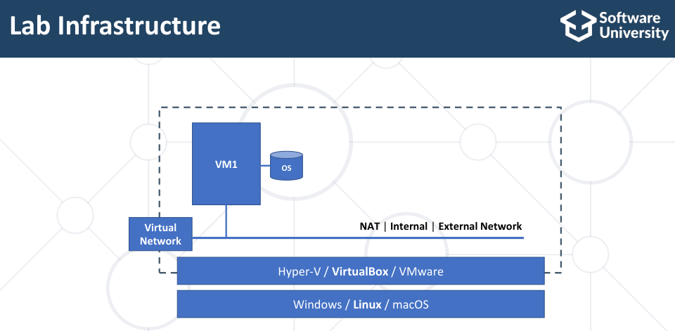
<br>
<br>

## Scheduled task execution

[⬆ Back to top](#top)

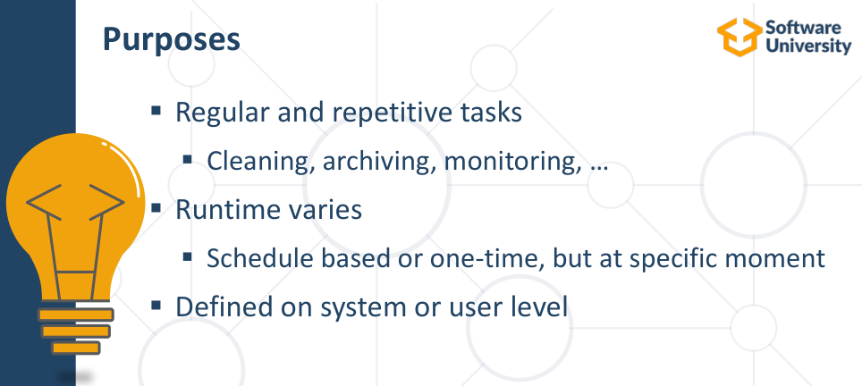
<br>
<br>

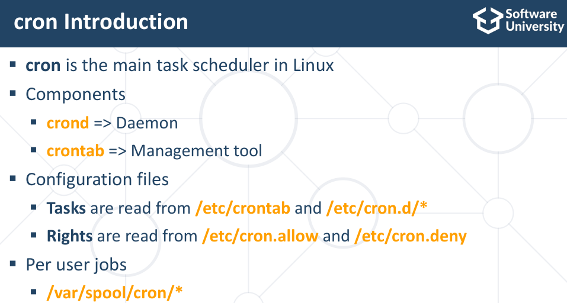
<br>
<br>

Configurations
- Tasks are configured in file /etc/crontab ot in directory /etc/cron.d/*
- We choose one approach for access rights to cron jobs - .allow or .deny. Do not mix .allow and .deny approach.

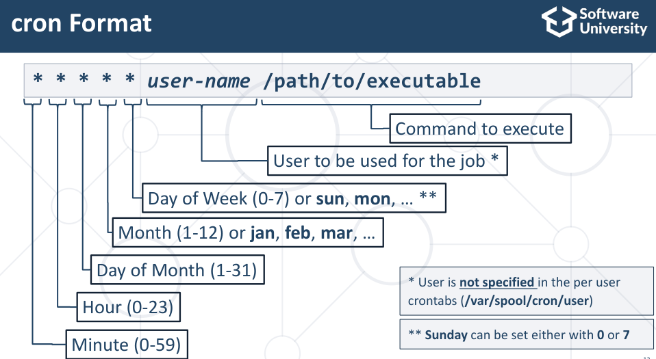
<br>
<br>

Configs for day is from 0 to 7 because some coutries start the week from sunday and other coutries start the week from onday, so both 0 and 7 are sunday.

Wehen we configure cron job for specific user the user field is skipped, because the specific user is set by default.

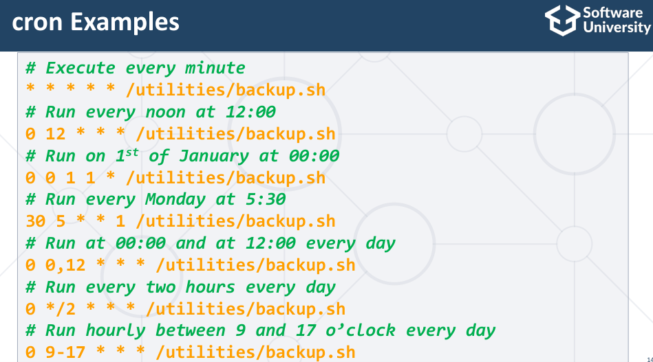
<br>
<br>

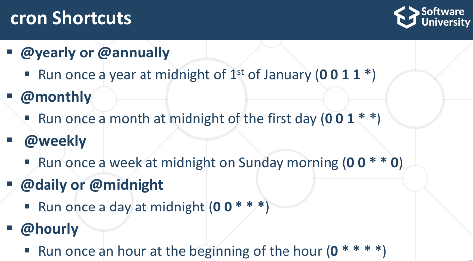
<br>
<br>

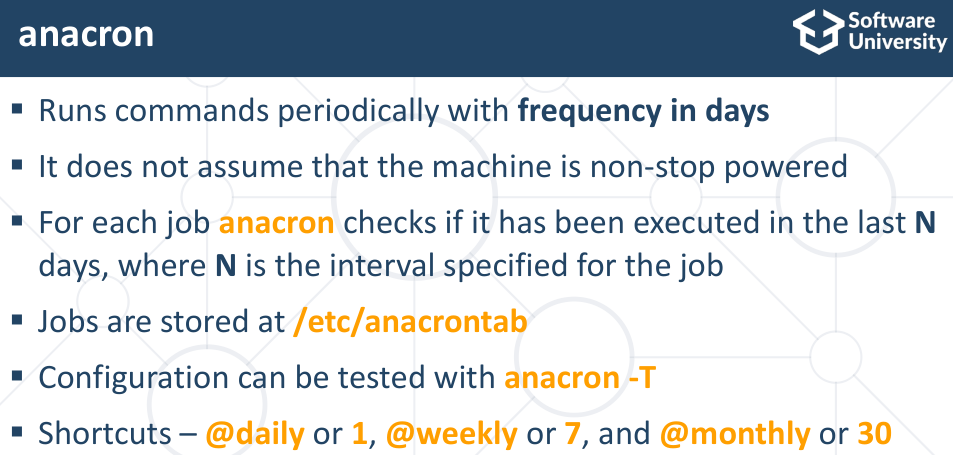
<br>
<br>

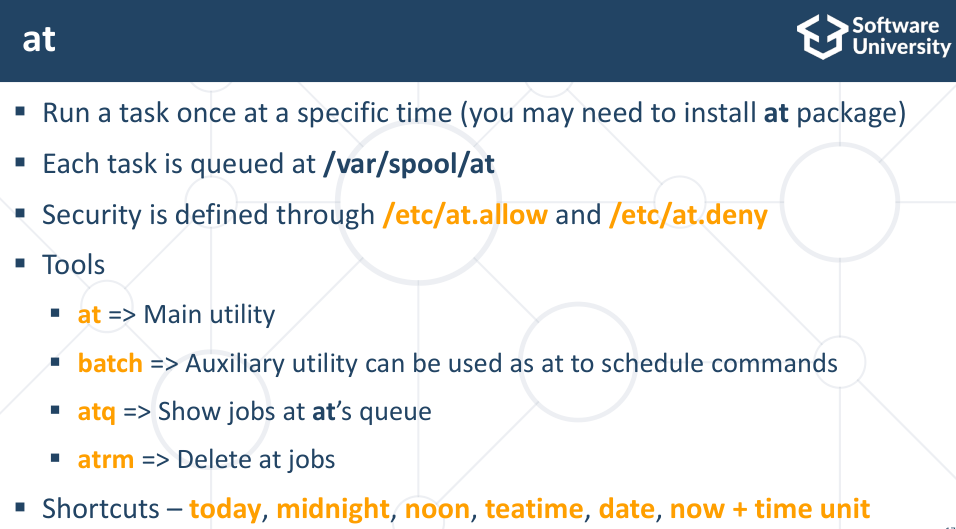
<br>
<br>

at - allow us to configure one time job in the future.

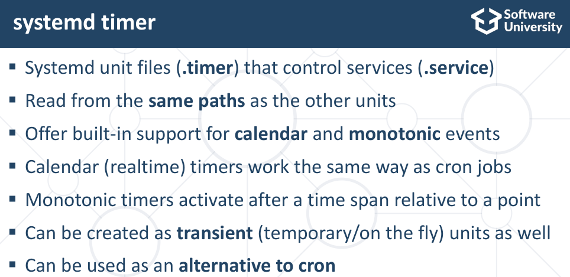
<br>
<br>

Systemd timer works with specific unit/service - the time is calling the unit/service.

Monotonic jobs can be configured to be executed in the future after a specific event. (example: 1 hour after system start)

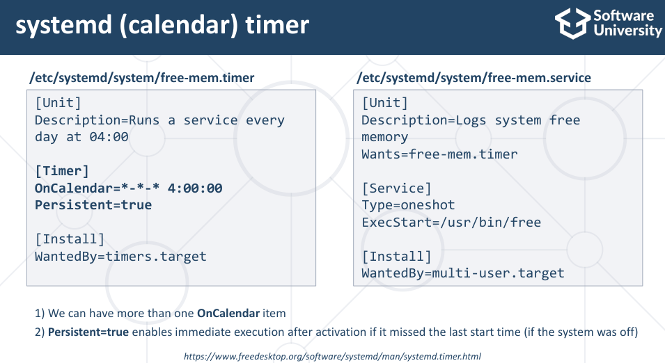
<br>
<br>

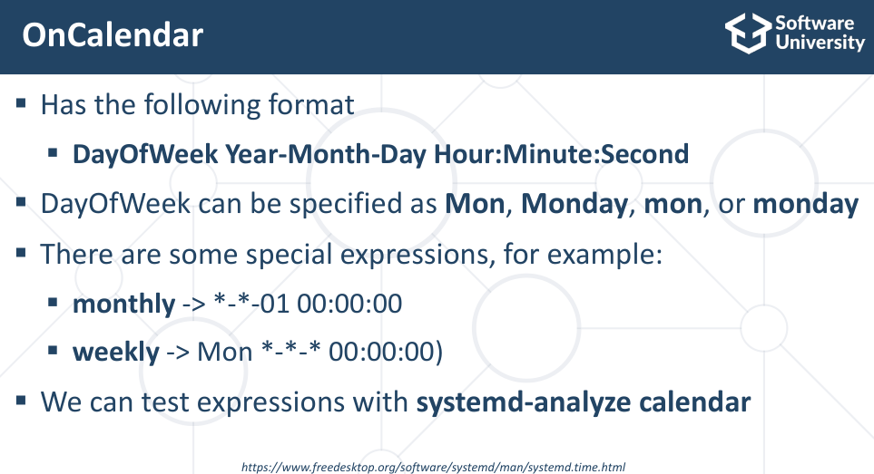
<br>
<br>

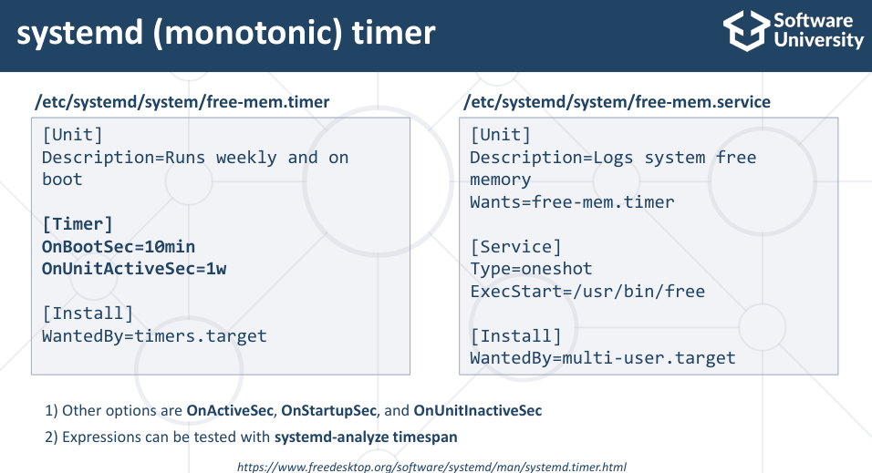
<br>
<br>

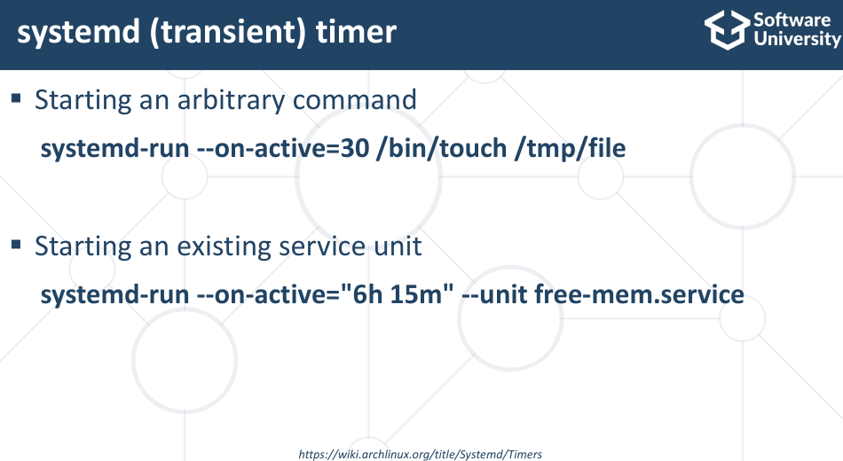
<br>
<br>

### Practice

Create VM from template or clone clean VM machine. We can check instructions in section 3 or 4.

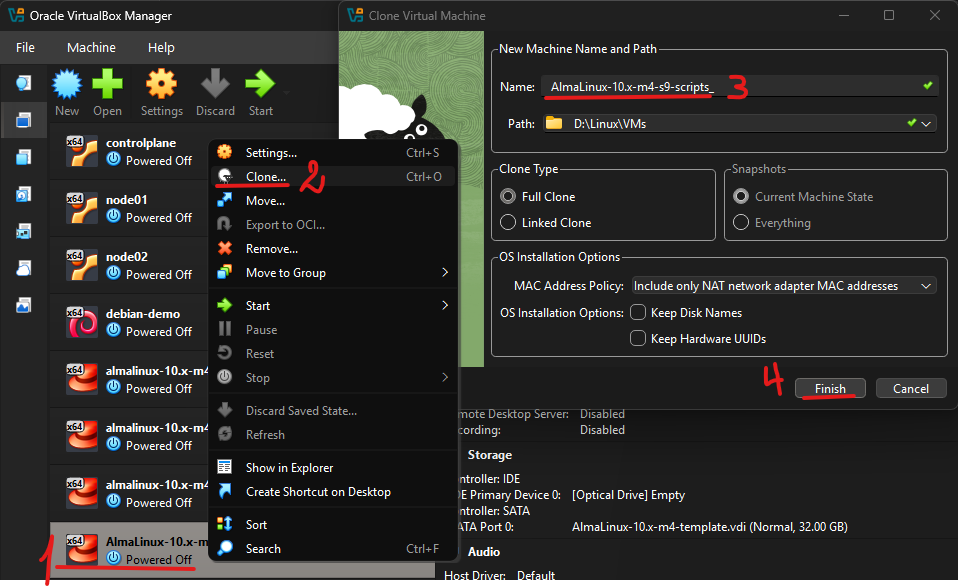
<br>
<br>

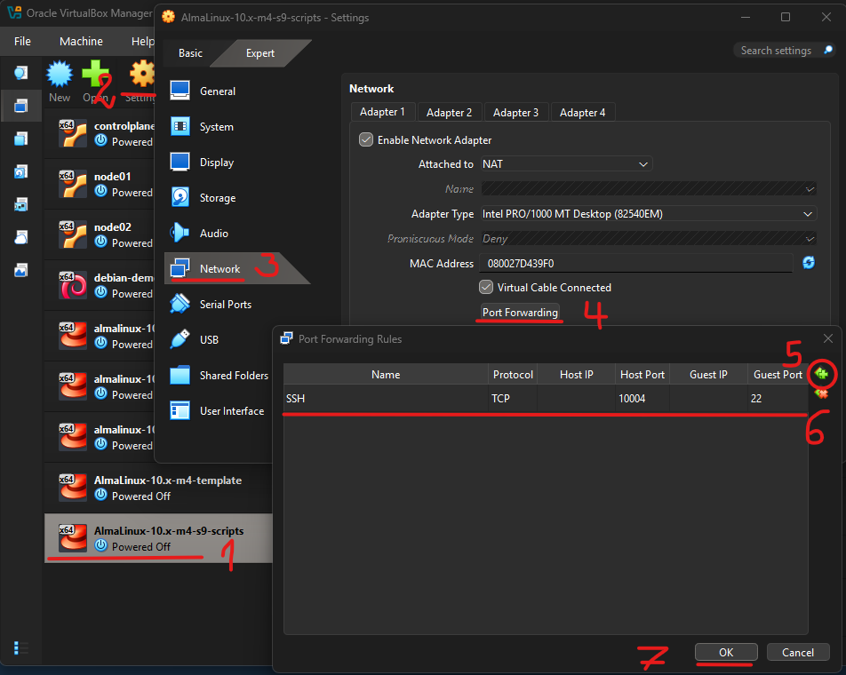
<br>
<br>

Connect to VM with SSH

        terminal --> ssh -p 10004 user@localhost

#### at

Install at

    terminal --> sudo dnf install at

Check if the at daemon is running

    terminal --> systemctl status atd

    # resuolt - not started:
    ○ atd.service - Deferred execution scheduler
      Loaded: loaded (/usr/lib/systemd/system/atd.service; enabled; preset: enabled)
      Active: inactive (dead)
        Docs: man:atd(8)

Start the at daemon and enable automatic start at system start

    terminal --> sudo systemctl enable --now atd

Check if the at daemon status again

    terminal --> systemctl status atd

    # result:
    ● atd.service - Deferred execution scheduler
        Loaded: loaded (/usr/lib/systemd/system/atd.service; enabled; preset: enabled)
        Active: active (running) since Fri 2026-04-17 19:13:37 CEST; 1min 21s ago
    Invocation: c5010fb574294713a7f00e42e4a59803
          Docs: man:atd(8)
      Main PID: 5748 (atd)
          Tasks: 1 (limit: 10656)
        Memory: 288K (peak: 1.2M)
            CPU: 10ms
        CGroup: /system.slice/atd.service
                └─5748 /usr/sbin/atd -f

    Apr 17 19:13:37 localhost.localdomain systemd[1]: Started atd.service - Deferred execution scheduler.
    Apr 17 19:13:37 localhost.localdomain (atd)[5748]: atd.service: Referenced but unset environment variable evaluates to an empty string: OPTS

Check the current date and time

    terminal --> date

    # result: Fri Apr 17 19:15:36 CEST 2026
  
Set a event that will trigger execution

    terminal --> at 19:20

    # result:
    warning: commands will be executed using /bin/sh
    at Fri Apr 17 19:20:00 2026

Set the command to be executed

    at --> echo $(date) >> /tmp/at1.log
    at --> echo "Done." >> /tmp/at1.log

    exit at with ctrl + d

    # result:
    at> <EOT>
    job 1 at Fri Apr 17 19:20:00 2026

Set a second task with different configuration

    terminal --> at now + 2 minutes
    at --> echo $(date) >> /tmp/at1.log
    at --> echo "Done as well." >> /tmp/at2.log

    exit at with ctrl + d

    # result:
    at> <EOT>
    job 2 at Fri Apr 17 19:22:00 2026

Check at tasks

    terminal --> atq

    # resutl:
    2       Fri Apr 17 19:22:00 2026 a user

Add a third task a bil later than the current moment

    terminal --> at now + 60 minutes
    at --> tar czvh /tmp/etc.tar.zg /etc 2> /tmp/at3.log

    exit at with ctrl + d

    # result:
    at> <EOT>
    job 3 at Fri Apr 17 20:22:00 2026

Check at tasks

    terminal --> atq

    # result: 3       Fri Apr 17 20:22:00 2026 a user

We can delete some of the tasks we have defined - in this case #3 and check at tasks

    terminal --> atrm 3
    terminal --> atq

    # result: empty

Check results of the task 1 and 2

    terminal --> cat /tmp/at1.log

    # result:
    Fri Apr 17 19:20:00 CEST 2026
    Done.

    termimnal --> cat /tmp/at2.log

    # result:
    Fri Apr 17 19:22:00 CEST 2026
    Done as well.

#### cron

Check if cron is avalable

    terminal --> systemctl status crond

    # result:
    ● crond.service - Command Scheduler
        Loaded: loaded (/usr/lib/systemd/system/crond.service; enabled; preset: enabled)
        Active: active (running) since Fri 2026-04-17 09:25:49 CEST; 10h ago
    Invocation: ab3df5c54d94402bb901a84480b4c622
      Main PID: 836 (crond)
          Tasks: 1 (limit: 10656)
        Memory: 1.3M (peak: 3.3M)
            CPU: 583ms
        CGroup: /system.slice/crond.service
                └─836 /usr/sbin/crond -n

Check existing cron jobs

    terminal --> crontab -l     # result: no crontab for user

Create cron job. Enter edit cron mode

    terminal --> crontab -e

```cron
* * * * * wall 'Hello world! I am running on schedule :)'
```

save and exit - :wq!

    # result:
    no crontab for user - using an empty one
    crontab: installing new crontab

Now each minute we will see the message we set on the console.

Show our cron plan

    terminal --> sudo ls -al /var/spool/cron/
    terminal --> user@pass

    # result:
    total 4
    drwx------. 2 root root 18 Apr 17 20:12 .
    drwxr-xr-x. 7 root root 66 Apr 17 19:10 ..
    -rw-------. 1 user user 58 Apr 17 20:12 user      # this is our job plan

Print our user cron plan

    terminal --> sudo cat /var/spool/cron/user

    # result:
    * * * * * wall 'Hello world! I am running on schedule :)'
  
We are connected with SSH to the VM. This mean that we will not get the cron job in this console. We will see the text we configured to be printed on the console only in the VM's console.

Print another message with wall and check the VM's console

    terminal --> wall 'Hello'

    # result:

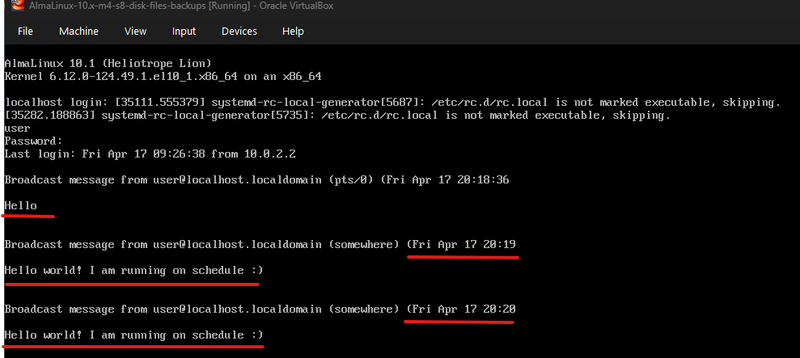
<br>
<br>


We can delete this cron job like eter the plan and set comment to the job or delete it. Then add another job - every minute save processes in file.

    terminal --> crontab -e

```cron
# * * * * * wall 'Hello world! I am running on schedule :)'
# */3 * * * * ps ax | wc -l >> /tmp/running_processes.log
* * * * * ps ax | wc -l >> /tmp/running_processes.log
```

save and exit - :wq!

    # result:
    crontab: installing new crontab
    Backup of user's previous crontab saved to /home/user/.cache/crontab/crontab.bak

List cronjobs

    terminal --> crontab -l

    # result:
    # * * * * * wall 'Hello world! I am running on schedule :)'
    # */3 * * * * ps ax | wc -l >> /tmp/running_processes.log
    * * * * * ps ax | wc -l >> /tmp/running_processes.log

Wait a few minutes and check if the processes count are saved

    terminal --> cat /tmp/running_processes.log

    # result: we should see around 110 - 115 processes saved

We wil create daily cron job for creating an archive for folder /etc

1. Create a backup folder for the archives and set our user to be the owner of the created directory

    terminal --> sudo mkdir /backups
    terminal --> sudo chown user:user /backups

2. Install tar

    terminal --> sudo dnf install tar 

3. Create the cronjob and redirect the success and error logs to one separate log file. The archive name is formed from current year-month-day and archive type extension

    terminal --> tar -czf /backups/etc-$(date +\%Y-\%m-\%d).tar.gz /etc > /tmp/tar.log 2>&1

4. Check the log file

    terminal --> cat /tmp/tar.log

    We receive some access denail messages. We can ignore them for now

5. Check the backups folder - we can see that the archive is being made

    terminal --> ls -al /backups/

    result:
    total 4636
    drwxr-xr-x.  2 user user      35 Apr 17 20:48 .
    dr-xr-xr-x. 19 root root     250 Apr 17 20:44 ..
    -rw-r--r--.  1 user user 4744450 Apr 17 20:48 etc-2026-04-17.tar.gz   # archive

We can now set the command as a cron job to executed every day

6. Set cron job with archive command

- Check the current time

    terminal --> date

    result:
    Fri Apr 17 20:55:24 CEST 2026

- Set the command to be executed in the next few minutes

    terminal --> crontab -e
    
```cron
59 20 * * * tar -czf /backups/etc-$(date +\%Y-\%m-\%d).tar.gz /etc > /tmp/tar.log 2>&1
```

save and exit - :wq!

    # result:
    crontab: installing new crontab
    Backup of user's previous crontab saved to /home/user/.cache/crontab/crontab.bak

- Clean the file so we can see the new record

    terminal --> rm /backups/etc-2026-04-17.tar.gz

- Check if the folder is empty

    terminal --> ls -al /backups

    result:
    total 0
    drwxr-xr-x.  2 user user   6 Apr 17 20:58 .
    dr-xr-xr-x. 19 root root 250 Apr 17 20:44 ..

We can now list the cron jobs

    termnal --> crontab -l

    # result:
    # * * * * * wall 'Hello world! I am running on schedule :)'
    # */3 * * * * ps ax | wc -l >> /tmp/running_processes.log
    * * * * * ps ax | wc -l >> /tmp/running_processes.log

    59 20 * * * tar -czf /backups/etc-$(date +\%Y-\%m-\%d).tar.gz /etc > /tmp/tar.log 2>&1

List backups folder to check if the job is executed 

    terminal --> ls -al /backups

    # result:
    total 4636
    drwxr-xr-x.  2 user user      35 Apr 17 20:59 .
    dr-xr-xr-x. 19 root root     250 Apr 17 20:44 ..
    -rw-r--r--.  1 user user 4744450 Apr 17 20:59 etc-2026-04-17.tar.gz   # created archive


Delete all cronjobs

    terminal --> crontab -e

Delete all jobs with - 22dd
save and exit file :wq!

    # result:
    crontab: installing new crontab
    Backup of user's previous crontab saved to /home/user/.cache/crontab/crontab.bak

We can see that after the deletion a backup file for cronjobs is created so we can restore the deleted cronjobs

List cronjobs

    terminal --> crontab -l

    # result: empty

<h3>All cron jobs commands must be tested before set in cron plan !!! We must make sure that the jobs commands are working propery and has the appropriate rights</h3>

#### systemd timers

List systemd timers

    terminal --> systemctl list-timers --all

    # result:
    NEXT                             LEFT LAST                            PASSED UNIT       >
    Fri 2026-04-17 21:42:00 CEST    37min Fri 2026-04-17 20:25:10 CEST 39min ago dnf-makecac>
    Sat 2026-04-18 00:16:10 CEST 3h 11min Fri 2026-04-17 09:55:26 CEST   11h ago logrotate.t>
    Sat 2026-04-18 09:41:20 CEST      12h Fri 2026-04-17 09:41:20 CEST   11h ago systemd-tmp>
    Mon 2026-04-20 00:33:39 CEST   2 days Wed 2026-04-15 12:25:51 CEST         - fstrim.time>

    4 timers listed.

We can print the status of some of the default times

    terminal --> systemctl status dnf-makecache.timer

    # result:
    ● dnf-makecache.timer - dnf makecache --timer
        Loaded: loaded (/usr/lib/systemd/system/dnf-makecache.timer; enabled; preset: enabled)
        Active: active (waiting) since Fri 2026-04-17 09:25:46 CEST; 11h ago
    Invocation: a1bac080d49f421aac42ef9213bb8628
        Trigger: Fri 2026-04-17 21:42:00 CEST; 35min left
      Triggers: ● dnf-makecache.service

    Apr 17 09:25:46 localhost systemd[1]: Started dnf-makecache.timer - dnf makecache --timer.

We can also print the timer info

    terminal --> systemctl cat dnf-makecache.timer

    # result:
    # /usr/lib/systemd/system/dnf-makecache.timer
    [Unit]
    Description=dnf makecache --timer
    ConditionKernelCommandLine=!rd.live.image
    # See comment in dnf-makecache.service
    ConditionPathExists=!/run/ostree-booted
    Wants=network-online.target

    [Timer]
    OnBootSec=10min
    OnUnitInactiveSec=1h
    RandomizedDelaySec=60m
    Unit=dnf-makecache.service

    [Install]
    WantedBy=timers.target


##### Transient systemd timer

1. Task 1 - fail to save message to file. Troubleshoot with journal. 

Transient timer is job executed one time on the run. 60 seconds after the task is crated save message in /tmp/timer1.log. The 

    terminal --> sudo systemd-run --on-active=60 echo "Executed at $(date)" > /tmp/timer1.log

    # result:
    Running timer as unit: run-p6342-i6642.timer
    Will run service as unit: run-p6342-i6642.service

Check the file and the service

    terminal --> systemctl cat run-p6342-i6642.timer
    terminal --> systemctl cat run-p6342-i6642.service

List systemd timers

    terminal --> systemctl list-timers --all

    # result: our timer is executed and is deleted from timers list

We can check the file and see that the file is empty and no message was saved in ti

    terminal --> sudo cat /tmp/timer1.log

    # result: empty

Check the journal and see that the message was executed successfully but the result was not saved.

    terminal --> sudo journalctl -u run-p6342-i6642.service

    # result:
    Apr 17 21:14:00 localhost.localdomain systemd[1]: Started run-p6342-i6642.service - [systemd-run] /bin>
    Apr 17 21:14:00 localhost.localdomain echo[6352]: Executed at Fri Apr 17 21:12:48 CEST 2026
    Apr 17 21:14:00 localhost.localdomain systemd[1]: run-p6342-i6642.service: Deactivated successfully.


2. Task 2 - crate manual service and attach transiant timer.

Craete service

    terminal --> sudo vi /etc/systemd/system/free-mem.service

```yaml
[Unit]
Description=Logs system free memory
Wants=free-mem.timer

[Service]
Type=oneshot
ExecStart=/usr/bin/free -h

[Install]
WantedBy=multi-user.target
```
Save the content and exit the file - :wq!

Create transient timer and attch it to the craeted service

    terminal --> sudo systemd-run --on-active=60 --unit free-mem.service

    # result: Running timer as unit: free-mem.timer

List timers and check that the created one is acailable - the first one

    terminal --> systemctl list-timers --all

    # result:
    NEXT                             LEFT LAST                              PASSED UNIT                   >
    Fri 2026-04-17 21:29:40 CEST      36s -                                      - free-mem.timer         >
    Fri 2026-04-17 21:42:00 CEST    12min Fri 2026-04-17 20:25:10 CEST 1h 3min ago dnf-makecache.timer    >
    Sat 2026-04-18 00:16:10 CEST 2h 47min Fri 2026-04-17 09:55:26 CEST     11h ago logrotate.timer        >
    Sat 2026-04-18 09:41:20 CEST      12h Fri 2026-04-17 09:41:20 CEST     11h ago systemd-tmpfiles-clean.>
    Mon 2026-04-20 00:33:39 CEST   2 days Wed 2026-04-15 12:25:51 CEST           - fstrim.timer 

Wait the time left for the timer to be executed.

Check the journal for this timer

    terminal --> sudo journalctl -u free-mem.service 

    # result:
    Apr 17 21:30:01 localhost.localdomain systemd[1]: Starting free-mem.service - Logs system free memory.>
    Apr 17 21:30:01 localhost.localdomain free[6498]:                total        used        free      sh>
    Apr 17 21:30:01 localhost.localdomain free[6498]: Mem:           1.7Gi       384Mi       1.1Gi       6>
    Apr 17 21:30:01 localhost.localdomain free[6498]: Swap:          2.0Gi          0B       2.0Gi
    Apr 17 21:30:01 localhost.localdomain systemd[1]: free-mem.service: Deactivated successfully.
    Apr 17 21:30:01 localhost.localdomain systemd[1]: Finished free-mem.service - Logs system free memory.

Check the status of the service that was executed.

    terminal --> systemctl status free-mem.service

    # result:
    ○ free-mem.service - Logs system free memoryQ
        Loaded: loaded (/etc/systemd/system/free-mem.service; disabled; preset: disabled)
        Active: inactive (dead)

    Apr 17 21:30:01 localhost.localdomain systemd[1]: Starting free-mem.service - Logs system free memory.>
    Apr 17 21:30:01 localhost.localdomain free[6498]:                total        used        free      sh>
    Apr 17 21:30:01 localhost.localdomain free[6498]: Mem:           1.7Gi       384Mi       1.1Gi       6>
    Apr 17 21:30:01 localhost.localdomain free[6498]: Swap:          2.0Gi          0B       2.0Gi
    Apr 17 21:30:01 localhost.localdomain systemd[1]: free-mem.service: Deactivated successfully.
    Apr 17 21:30:01 localhost.localdomain systemd[1]: Finished free-mem.service - Logs system free memory.

We can see that the service is disabld and will not be executed any nore.

##### calendar systemd timer

We can create permanent timer/service pair that will be executed periodically with calendar.

How to claculate our calendar

    terminal --> systemd-analyze calendar weekly

    # result:
      Original form: weekly
    Normalized form: Mon *-*-* 00:00:00
        Next elapse: Mon 2026-04-20 00:00:00 CEST
          (in UTC): Sun 2026-04-19 22:00:00 UTC
          From now: 2 days left

Check calendat dor specific rules

Rule 1:

    terminal --> systemd-analyze calendar "Wed *-*-* 12:00:00"

    # result:
    Normalized form: Wed *-*-* 12:00:00
        Next elapse: Wed 2026-04-22 12:00:00 CEST
          (in UTC): Wed 2026-04-22 10:00:00 UTC
          From now: 4 days left

Rule 2: monday - tuesday , first - fourth date of the month

    terminal --> systemd-analyze calendar "Mon,Tue *-*-01..04 12:00:00"

    # result:
    Normalized form: Mon,Tue *-*-01..04 12:00:00
        Next elapse: Mon 2026-05-04 12:00:00 CEST
          (in UTC): Mon 2026-05-04 10:00:00 UTC
          From now: 2 weeks 2 days left

Rule 3: every day, every 2 minutes

    terminal --> systemd-analyze calendar "*-*-* *:0/2:00"
    or
    terminal --> systemd-analyze calendar "*:0/2:00"

    # result:
      Original form: *-*-* *:0/2:00
    Normalized form: *-*-* *:00/2:00
        Next elapse: Fri 2026-04-17 22:00:00 CEST
          (in UTC): Fri 2026-04-17 20:00:00 UTC
          From now: 1min 52s left

Rule 4: check the rule for next X interation

    terminal --> systemd-analyze calendar --iterations=7 "*:0/2:00"

    # result:
      Original form: *:0/2:00
    Normalized form: *-*-* *:00/2:00
        Next elapse: Fri 2026-04-17 22:02:00 CEST
          (in UTC): Fri 2026-04-17 20:02:00 UTC
          From now: 1min 53s left
      Iteration #2: Fri 2026-04-17 22:04:00 CEST
          (in UTC): Fri 2026-04-17 20:04:00 UTC
          From now: 3min 53s left
      Iteration #3: Fri 2026-04-17 22:06:00 CEST
          (in UTC): Fri 2026-04-17 20:06:00 UTC
          From now: 5min left
      Iteration #4: Fri 2026-04-17 22:08:00 CEST
          (in UTC): Fri 2026-04-17 20:08:00 UTC
          From now: 7min left
      Iteration #5: Fri 2026-04-17 22:10:00 CEST
          (in UTC): Fri 2026-04-17 20:10:00 UTC
          From now: 9min left
      Iteration #6: Fri 2026-04-17 22:12:00 CEST
          (in UTC): Fri 2026-04-17 20:12:00 UTC
          From now: 11min left
      Iteration #7: Fri 2026-04-17 22:14:00 CEST
          (in UTC): Fri 2026-04-17 20:14:00 UTC
          From now: 13min left

Rule 5: complex rule and interations

    terminal --> systemd-analyze calendar "Mon,Tue *-*-01..04 12:00:00" --iterations=3

    # result:
    Normalized form: Mon,Tue *-*-01..04 12:00:00
        Next elapse: Mon 2026-05-04 12:00:00 CEST
          (in UTC): Mon 2026-05-04 10:00:00 UTC
          From now: 2 weeks 2 days left
      Iteration #2: Mon 2026-06-01 12:00:00 CEST
          (in UTC): Mon 2026-06-01 10:00:00 UTC
          From now: 1 month 14 days left
      Iteration #3: Tue 2026-06-02 12:00:00 CEST
          (in UTC): Tue 2026-06-02 10:00:00 UTC
          From now: 1 month 15 days left


We will create timer that will start free-mem service.

Create timer file

    terminal --> sudo vi /etc/systemd/system/free-mem.timer

```yaml
[Unit]
Description=Run service every 2 minutes


[Timer]
OnCalendar=*:0/2
Persistent=true

[Install]
WantedBy=timers.target
```
save and exit the file - :wq!

Enable and start the calendar timer

    terminal --> sudo systemctl enable --now free-mem.timer
    
    # result:
    Created symlink '/etc/systemd/system/timers.target.wants/free-mem.timer' → '/etc/systemd/system/free-mem.timer'.

List timers

    terminal --> systemctl list-timers --all

    # result:
    NEXT                             LEFT LAST                            PASSED UNIT                         ACTIVATES         >
    Fri 2026-04-17 22:14:00 CEST      47s -                                    - free-mem.timer               free-mem.service
    Fri 2026-04-17 23:36:48 CEST 1h 23min Fri 2026-04-17 21:42:12 CEST 31min ago dnf-makecache.timer          dnf-makecache.serv>
    Sat 2026-04-18 00:23:07 CEST  2h 9min Fri 2026-04-17 09:55:26 CEST   12h ago logrotate.timer              logrotate.service
    Sat 2026-04-18 09:41:20 CEST      11h Fri 2026-04-17 09:41:20 CEST   12h ago systemd-tmpfiles-clean.timer systemd-tmpfiles-c>
    Mon 2026-04-20 01:09:57 CEST   2 days Wed 2026-04-15 12:25:51 CEST         - fstrim.timer                 fstrim.service

    5 timers listed.

Wait the time so the timer execute.

Check the journal for logs. We can see the first timer and now the second one,

    terminal --> sudo journalctl -u free-mem.service

    # result:
    Apr 17 21:30:01 localhost.localdomain systemd[1]: Starting free-mem.service - Logs system free memory...
    Apr 17 21:30:01 localhost.localdomain free[6498]:                total        used        free      shared  buff/cache   ava>
    Apr 17 21:30:01 localhost.localdomain free[6498]: Mem:           1.7Gi       384Mi       1.1Gi       6.1Mi       313Mi      >
    Apr 17 21:30:01 localhost.localdomain free[6498]: Swap:          2.0Gi          0B       2.0Gi
    Apr 17 21:30:01 localhost.localdomain systemd[1]: free-mem.service: Deactivated successfully.
    Apr 17 21:30:01 localhost.localdomain systemd[1]: Finished free-mem.service - Logs system free memory.
    Apr 17 22:14:20 localhost.localdomain systemd[1]: Starting free-mem.service - Logs system free memory...
    Apr 17 22:14:20 localhost.localdomain free[6661]:                total        used        free      shared  buff/cache   ava>
    Apr 17 22:14:20 localhost.localdomain free[6661]: Mem:           1.7Gi       387Mi       1.1Gi       6.1Mi       314Mi      >
    Apr 17 22:14:20 localhost.localdomain free[6661]: Swap:          2.0Gi          0B       2.0Gi
    Apr 17 22:14:20 localhost.localdomain systemd[1]: free-mem.service: Deactivated successfully.
    Apr 17 22:14:20 localhost.localdomain systemd[1]: Finished free-mem.service - Logs system free memory.

We can diable specific calendar timer with the command we would disable service. This command disable the timer for the current moment and as for the future execution also.

    terminal --> sudo systemctl disable --now free-mem.timer

    # result:
    Removed '/etc/systemd/system/timers.target.wants/free-mem.timer'.

<h3>Transient timers are enabled and started automatically but all other timers must be enabled and started manually</h3>

[⬆ Back to top](#top) dWEG I|


## Bash scripts building blocks

[⬆ Back to top](#top)

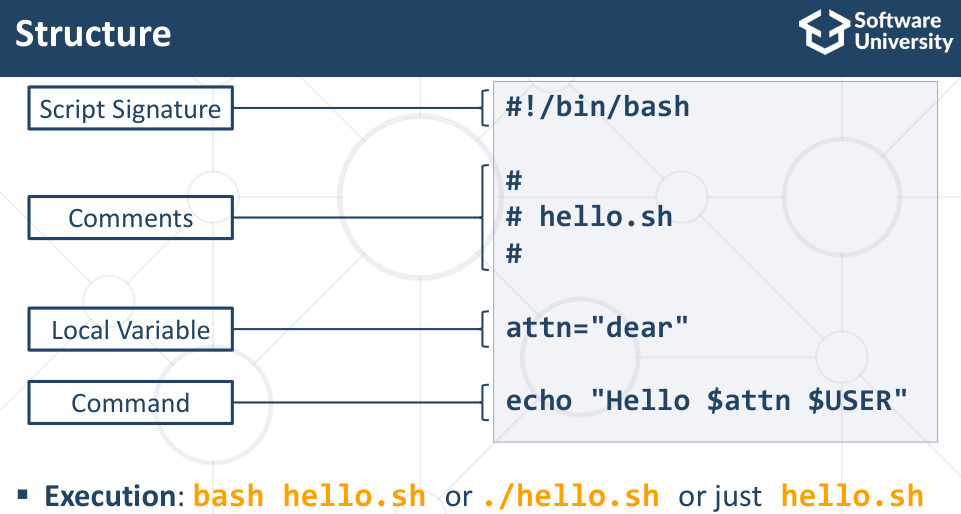
<br>
<br>

bash hello.sh - do not need included execution right.
./hello.sh or hello.sh need the execution rights to be included.

We can set alternative signature. The standard is '#!/bin/bash' and the alternative is '#!/bin/env bash'. The alternative signature is more flexible. It can use non standard bash installation.

### Commands and Flow Control #1

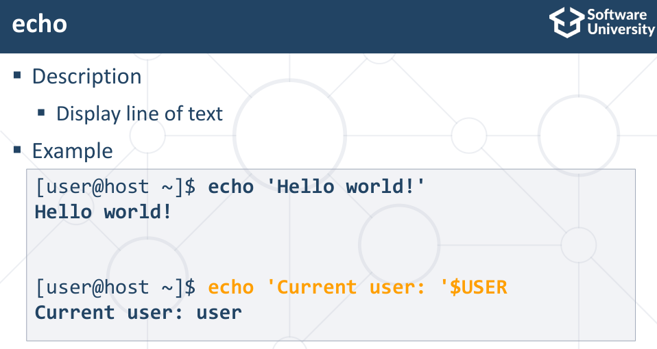
<br>
<br>

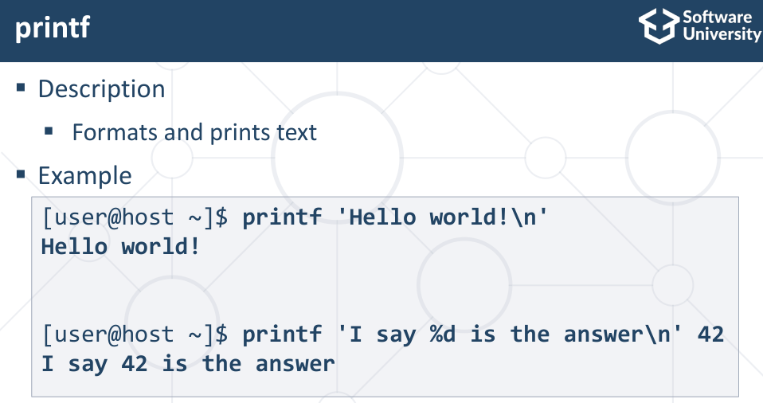
<br>
<br>

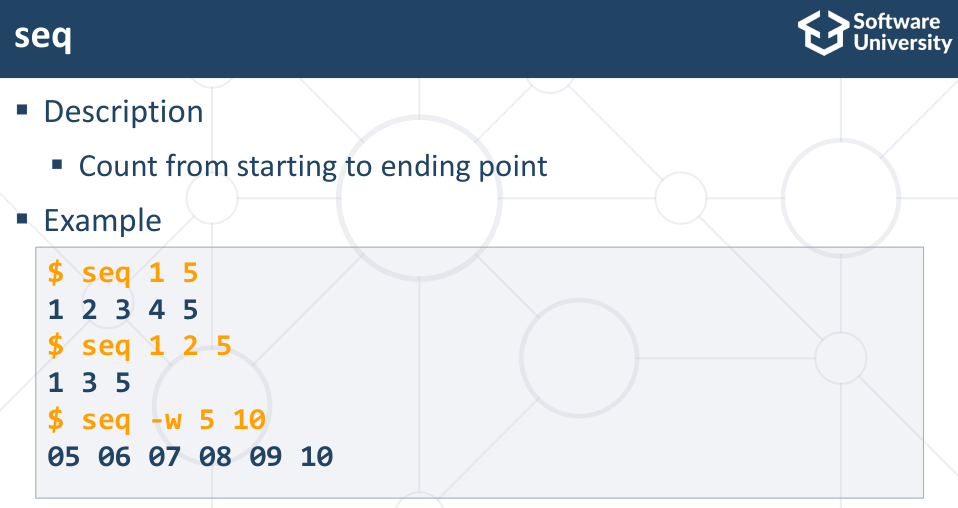
<br>
<br>


104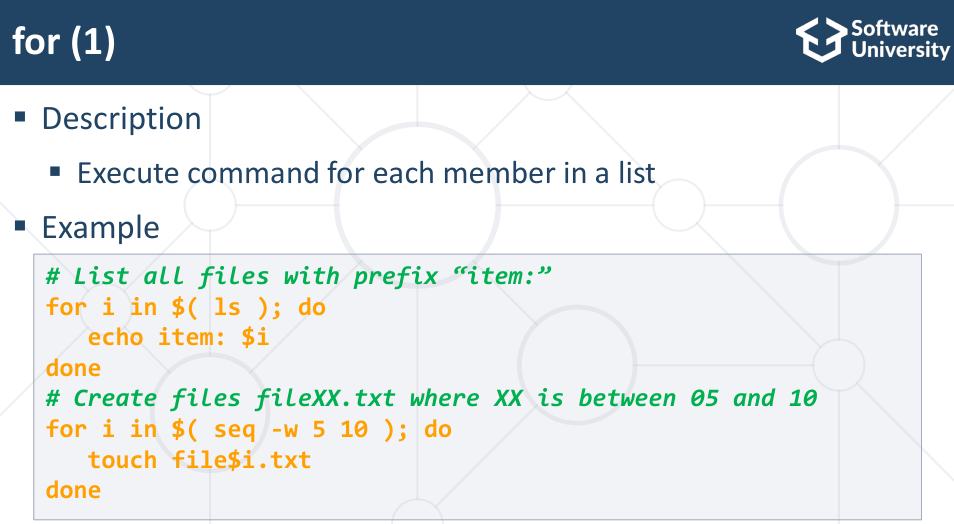
<br>
<br>

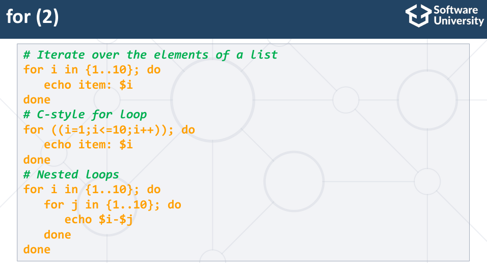
<br>
<br>

### Practice

Connect to VM with SSH

        terminal --> ssh -p 10004 user@localhost

#### basic scripts, interpreters and execution

We will create script with standard process
- Craete the script
- Give the scripts appropriate rights
- Execute the script
  
Create script s1.sh - hellow world

    terminal --> vi s1.sh

```sh
#!/bin/bash

# Prints Hello World and exit

echo "Hello World!"
```
save and exit - :wq!

Set execute rights to the script

    terminal --> chmod +x s1.sh

Execute the script

    terminal --> ./s1.sh

    # result:
    Hello World!


We can remove the rights and try to execute it again

    terminal --> chmod -x s1.sh
    terminal --> ./s1.sh

    # result: -bash: ./s1.sh: Permission denied

We can execute it with bash interpreter and it will work properly without we have to set rights. If we remove the '#!/bin/bash' from the script and run the sript with bash interpreter it will still workd properly.

Remove signature

    terminal --> vi s1.sh

```sh
# Prints Hello World and exit

echo "Hello World!"
```
save and exit - :wq

Run the script

    terminal --> bash s1.sh

    # result:
    Hello World!

Example with alternative interpreter signature

Edit the sript and set alternative signatures. The alternative signature says - find the interpreter and use it.

    terminal --> vi s1.sh

```sh
#!/bin/env bash

# Prints Hello World and exit

echo "Hello World!"
```
save and exit - :wq

Set execute right to the script

    terminal --> chmod +x s1.sh

Run the script

    terminal --> ./s1.sh

    # result:
    Hello World!

We can see where env and bash are. They appears to be in a different folders than we set in the script signature.

    terminal --> whereis env

    # result: env: /usr/bin/env /usr/share/man/man1/env.1.gz

    terminal --> whereis bash

    # result: bash: /usr/bin/bash /usr/share/man/man1/bash.1.gz /usr/share/info/bash.info.gz

Then how do they work? They work with sibolic link with the interpreters.

    terminal --> ls -l /

    # result:
    total 24
    dr-xr-xr-x.   2 root root    6 Apr  2  2025 afs
    lrwxrwxrwx.   1 root root    7 Apr  2  2025 bin -> usr/bin          # interpreter
    dr-xr-xr-x.   5 root root 4096 Apr 18 09:40 boot
    drwxr-xr-x.  20 root root 3280 Apr 18 09:39 dev
    drwxr-xr-x.  81 root root 8192 Apr 18 09:39 etc
    drwxr-xr-x.   3 root root   18 Apr 15 12:23 home
    lrwxrwxrwx.   1 root root    7 Apr  2  2025 lib -> usr/lib
    lrwxrwxrwx.   1 root root    9 Apr  2  2025 lib64 -> usr/lib64
    drwxr-xr-x.   2 root root    6 Apr  2  2025 media
    drwxr-xr-x.   2 root root    6 Apr  2  2025 mnt
    drwxr-xr-x.   2 root root    6 Apr  2  2025 opt
    dr-xr-xr-x. 167 root root    0 Apr 18 09:39 proc
    dr-xr-x---.   3 root root  126 Apr 15 12:23 root
    drwxr-xr-x.  31 root root  860 Apr 18 09:39 run
    lrwxrwxrwx.   1 root root    8 Apr  2  2025 sbin -> usr/sbin
    drwxr-xr-x.   2 root root    6 Apr  2  2025 srv
    dr-xr-xr-x.  13 root root    0 Apr 18 09:39 sys
    drwxrwxrwt.   9 root root 4096 Apr 18 09:41 tmp
    drwxr-xr-x.  12 root root  144 Apr 15 12:19 usr
    drwxr-xr-x.  19 root root 4096 Apr 15 12:25 var


Set back the standard signature.

    terminal --> vi s1.sh

```sh
#!/bin/bash

# Prints Hello World and exit

echo "Hello World!"
```
save and exit - :wq

Set script as PATH variable - We can set script as PATH variabe and use it with simplified name.

List PATH variables

    terminal --> echo $PATH

    # result: /home/user/.local/bin:/home/user/bin:/usr/local/bin:/usr/bin:/usr/local/sbin:/usr/sbin

We will create the same folder - bin and make a copy of the script with different name and use it with it.

    terminal --> mkdir bin
    terminal --> cp s1.sh bin/hello
    terminal --> hello

    # result:
    Hellow World!


Create a new simple script - s2.sh

    terminal --> vi s2.sh

```sh
#!/bin/bash

# Stores currect date and time in a file

filename=/tmp/date-time.txt

echo "Now is $(date)" > $filename
```
save and exit - :wq

Give the script execute rights and run it

    terminal --> chmod +x s2.sh
    terminal --> ./s2.sh

Check the result

    terminal --> cat /tmp/date-time.txt

    # result: Now is Sat Apr 18 10:19:08 CEST 2026

#### Scripts Automation

We will create a script for
- create a user
- set user rights
- welcome message for the user

The script has some misfunctions like
- user is harcoded
- command are not depending on the previous one in the sequence
  
We will use this script fo the simple example.

Create the script s3.sh. 

    terminal --> vi s3.sh

```sh
#!/bin/bash

# Create a user
username=demo

echo "* Create user $username"
useradd -m -s /bin/bash $username

echo "* Set password for the $username user"
passwd $username

echo "* Create a readme.txt file"
echo "Welcome to the club, $username" > /home/$username/readme.txt

echo "* Done."
```
Save and exit file - :wq

Give the script execute rights

    terminal --> chmod +x s3.sh

Run the script. We can see that we receive some error for permissions and commands.

    terminal --> ./s3.sh

    # result:
    * Create user demo
    useradd: Permission denied.
    useradd: cannot lock /etc/passwd; try again later.
    * Set password for the demo user
    passwd: user 'demo' does not exist
    * Create a readme.txt file
    ./s3.sh: line 13: /home/demo/readme.txt: No such file or directory
    Done.

Delete the user 'demo', remove the /home/demo folder and try again with sudo

    terminal --> sudo userdel demo
    terminal --> sudo rm -rf /home/demo

    terminal --> sudo ./s3.sh

    # result:
    * Create user demo
    * Set password for the demo user
    New password: demo
    BAD PASSWORD: The password is shorter than 8 characters
    Retype new password: demo
    passwd: password updated successfully
    * Create a readme.txt file
    * Done.

List last users and their details to make sure the user exists

    terminal --> tail /etc/passwd

    # result:
    nobody:x:65534:65534:Kernel Overflow User:/:/usr/sbin/nologin
    tss:x:59:59:Account used for TPM access:/:/usr/sbin/nologin
    systemd-oom:x:999:999:systemd Userspace OOM Killer:/:/sbin/nologin
    dbus:x:81:81:System Message Bus:/:/usr/sbin/nologin
    sssd:x:998:997:User for sssd:/run/sssd:/sbin/nologin
    sshd:x:74:74:Privilege-separated SSH:/usr/share/empty.sshd:/usr/sbin/nologin
    chrony:x:997:996:chrony system user:/var/lib/chrony:/sbin/nologin
    systemd-coredump:x:995:995:systemd Core Dumper:/:/usr/sbin/nologin
    user:x:1000:1000:LSA User:/home/user:/bin/bash
    demo:x:1001:1001::/home/demo:/bin/bash                  # the created user

List the created user home directory

    terminal --> sudo ls -l /home/demo

    # result:
    total 4
    -rw-r--r--. 1 root root 26 Apr 18 10:41 readme.txt


Print the file with the welcome message 

    terminal --> sudo cat /home/demo/readme.txt

    # result: Welcome to the club, demo

If we try to create the same user again we will get error the the user already exsit but we will able to change its password. This is one more misfunction of this simple script that we will ignore for now.

#### Execution vs Sourcing

In execution child session is created, the script is executed and the n the session is closed.
In sroucing the execution of the oprations are in the current session.


Create s4.sh script that validate this difference between sourcing and execution

    terminal --> vi s4.sh

```sh
#!/bin/bash

# Sourcing vs Execution

MYVAR=Hello

echo "MYVAR=$MYVAR"
echo "Executed on $(date) | tee /tmp/s4.txt"        # print text on the console and in file s4.txt
```
Save and exit file - :wq

Give the script execute rights

    terminal --> chmod +x s4.sh

Run the script with Execution. After we will print the variable we set and check that when the child session is closed all variables are removed also.

    terminal --> ./s4.sh

    # result:
    MYVAR=
    Executed on Sat Apr 18 11:25:46 CEST 2026 | tee /tmp/s4.txt

    terminal --> echo $MYVAR

    # result: empty


Run the sript with source and check for the variable is persistent. This mean that the operations are executed in the current session.

    terminal --> source ./s4.sh

    # result:
    MYVAR=Hello
    Executed on Sat Apr 18 11:30:01 CEST 2026 | tee /tmp/s4.txt

    terminal --> echo $MYVAR

    # result: Hello

#### Cycles / loops

Test different simple cycles

Test sequence from 1 to 10 with step 2

    terminal --> seq 1 2 10

    # result:
    1
    3
    5
    7
    9

Test sequence from 10 to 1 with step -1


    terminal --> seq 10 -1 1

    # result:
    10
    9
    8
    7
    6
    5
    4
    3
    2
    1

When we combine sequence with cycles we can execute complex operations

Simple example 

    terminal --> for i in a b c; do echo $i; done

    # result:
    a
    b
    c

Implement seq in the command

    terminal --> for i in $(seq 1 5); do echo "item: $i"; done
    or
    terminal --> for i in {1..5}; do echo "item: $i"; done

    # result:
    item: 1
    item: 2
    item: 3
    item: 4
    item: 5

Implement commands ls. ls -1 calls only first names of .sh files.

    terminal --> for i in $(ls -1 *.sh); do echo "item: $i"; done

    # result:
    item: s1.sh
    item: s2.sh
    item: s3.sh
    item: s4.sh

Implement cat in the srcipt. Create new file with town names

    terminal --> vi for.txt

```txt
varna
burgas
vidin
sofia
```

Executet script with the created file

    terminal --> for i in $(cat for.txt); do echo "item: $i"; done

    # result:
    item: varna
    item: burgas
    item: vidin
    item: sofia

We can combine commands in the executor. This will give us reverse sorted result

    terminal --> for i in $(cat for.txt | sort -r); do echo "item: $i"; done

    # result:
    item: vidin
    item: varna
    item: sofia
    item: burgas


Test C syntax loops

    terminal --> for ((i=0;i<=5;i++)); do echo "item: $i"; done

    # result:
    item: 0
    item: 1
    item: 2
    item: 3
    item: 4
    item: 5

Test nested loops

    terminal --> for i in {1..5}; do for j in {1..5}; do echo "i=$i,j=$j"; done; done

    # result:
    i=1,j=1
    i=1,j=2
    i=1,j=3
    i=1,j=4
    i=1,j=5
    i=2,j=1
    i=2,j=2
    i=2,j=3
    i=2,j=4
    i=2,j=5
    i=3,j=1
    i=3,j=2
    i=3,j=3
    i=3,j=4
    i=3,j=5
    i=4,j=1
    i=4,j=2
    i=4,j=3
    i=4,j=4
    i=4,j=5
    i=5,j=1
    i=5,j=2
    i=5,j=3
    i=5,j=4
    i=5,j=5

We can mix C syntax and sample syntax..

We will create cube with stars

    terminal --> for i in {1..5}; do for j in {1..10}; do echo -n '*'; done; echo ''; done

    # result:
    **********
    **********
    **********
    **********
    **********


### Commands and Flow Control #2

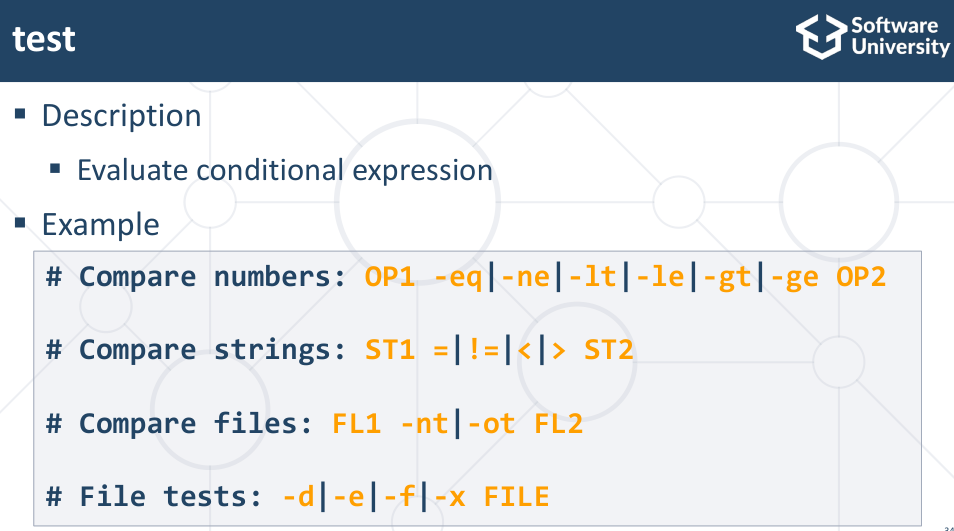
<br>
<br>

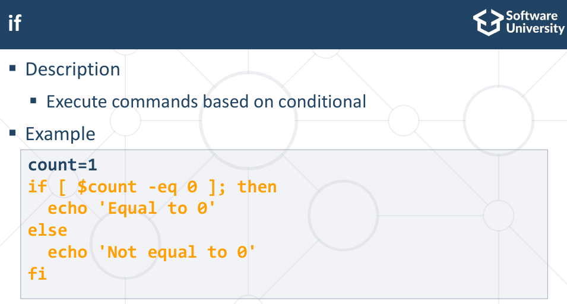
<br>
<br>

if - start the block
fi - finis the block

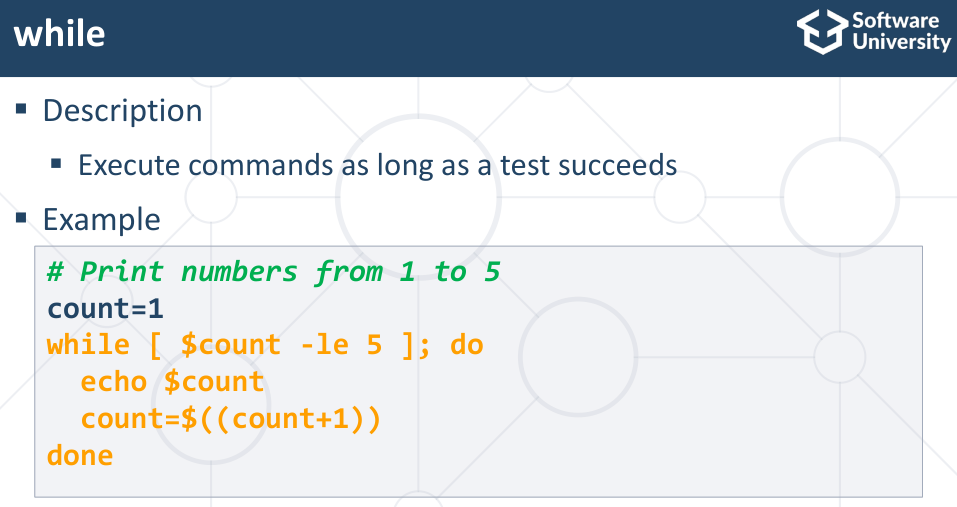
<br>
<br>

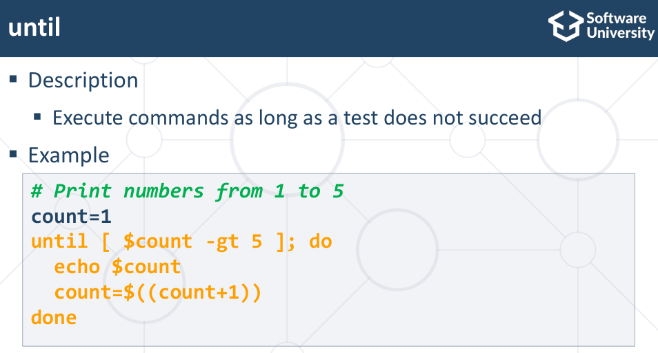
<br>
<br>

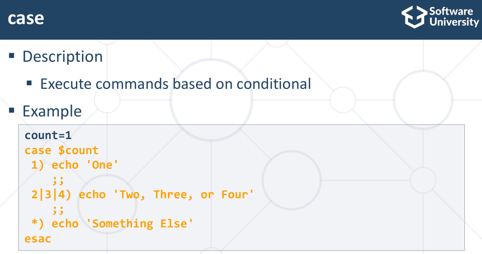
<br>
<br>

## Writing scripts in bash


<br>
<br>

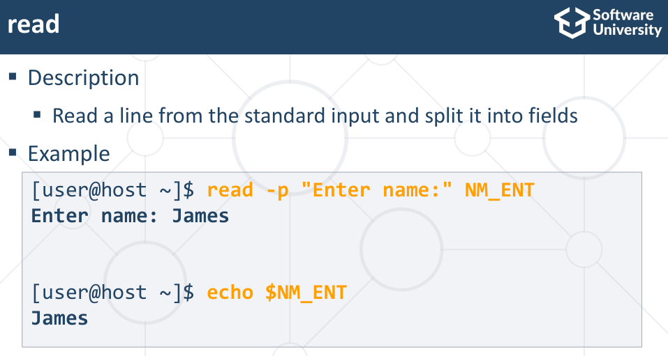
<br>
<br>

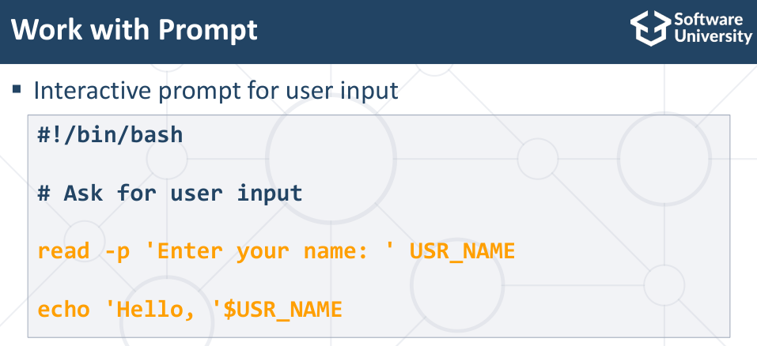
<br>
<br>

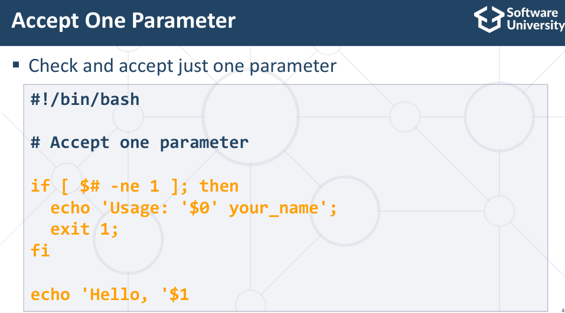
<br>
<br>

### Practice

#### while loop

initialize variable and execute while loop

    terminal --> count=1
    terminal --> while [ $count -le 5 ]; do echo "item: $count"; sleep 1; count=$((count+1)); done

    # result:
    item: 1
    item: 2
    item: 3
    item: 4
    item: 5


#### until loop

set the variable to 1 and execute until loop

    terminal --> count=1
    terminal --> until [ $count -gt 5 ]; do echo "item: $count"; sleep 1; count=$((count+1)); done

    # result:
    item: 1
    item: 2
    item: 3
    item: 4
    item: 5

#### interactive scripts

Create simple script example in file user-input-1.sh

    terminal --> vi user-input-1.sh

```sh
#!/bin/bash

#
# Ask for user input
# user-input-1.sh
# 

read -p 'Enter your name: ' USR_NAME
read -p "Okay $USR_NAME, what is your favorite color?" USR_COLOR
echo 'So, '$USR_NAME' You like '$USR_COLOR
echo 'I like it too, but mine favorite color is Blue'
```
<h3>When we form a text which we has variables we form it with double quotes. We can use only variables as excluding them with single quotes</h3>

Give execute rights to the script

    terminal --> chmod +x user-input-1.sh

Execute the srcipt

    terminal --> ./user-input-1.sh
    
    # result:
    Enter your name: Ivan
    Okay Ivan, what is your favorite color?red
    So, Ivan You like red
    I like it too, but mine favorite color is Blue


##### If - else script
Create second script - user-input-2.sh

    terminal --> vi user-input-2.sh

```sh
#!/bin/bash

#
# Ask for user input
# user-input-2.sh
# 

mynum=$((RANDOM%100))

read -p 'Enter a number between 0 and 100: ' yournum
echo 'So, your number is '$yournum' and mine is '$mynum

if [ $mynum -gt $yournum ]; then
   echo 'Mine is bigger.'
elif [ $mynuv -lt $yournum ]; then
   echo 'Mine is smaller.'
else
   echo 'They are equal'
fi
```

<h3>local script variables are lowercase and external variables are capital letters</h3>

Give execute rights to the script

    terminal --> chmod +x user-input-2.sh

Execute the srcipt

    terminal --> ./user-input-2.sh
    
    # result:
    Enter a number between 0 and 100: 34
    So, your number is 34 and mine is 92
    Mine is bigger.

#### Cycles / loops

In this example we will see a script with unknow lenght of the loop execution.

Create a cript in file user-input-3.sh

    terminal --> vi user-input-3.sh


```sh
#!/bin/bash

#
# Ask for user input
# user-input-3.sh
# 

read -p 'Do you want to see a random number? (y/n) ' answer
while [ $answer != 'n' ]; do
    echo "Here is one random number = $((RANDOM%100))"
    read -p 'Do you want to see a random number? (y/n) ' answer
done
```
save and exit file - :wq

Misfunctions of the script
- no input (yes) validation
- repeated question for input

Give execute rights to the script

    terminal --> chmod +x user-input-3.sh

Execute the srcipt

    terminal --> ./user-input-3.sh
    
    # result:
    Do you want to see a random number? (y/n) y
    Here is one random number = 70
    Do you want to see a random number? (y/n) y
    Here is one random number = 65
    Do you want to see a random number? (y/n) n


Create similar script but a with different construction - endless loop

    terminal --> vi user-input-4.sh

```sh
#!/bin/bash

#
# Ask for user input and loops
# user-input-4.sh
# 

while true; do
    read -p 'Do you want to see a random number? (y/n) ' answer
    if [ $answer != 'n' ]; then
        echo "Here is one random number = $((RANDOM%100))"
    else
        break;
    fi
done
```
save and exit - :wq

Give execute rights to the script

    terminal --> chmod +x user-input-4.sh

Execute the srcipt

    terminal --> ./user-input-4.sh

    # result:
    Do you want to see a random number? (y/n) y
    Here is one random number = 15
    Do you want to see a random number? (y/n) da
    Here is one random number = 82
    Do you want to see a random number? (y/n) d
    Here is one random number = 24
    Do you want to see a random number? (y/n) n


Set third kind of script with internal variable, input validation and not endless loop.

    terminal --> vi user-input-5.sh

```sh
#!/bin/bash

#
# Ask for user input and loops
# user-input-5.sh
# 

answer='x'

while [ $answer != 'n' ]; do
    read -p 'Do you want to see a random number? (y/n) ' answer
    if [ $answer = 'y' ]; then
        echo "Here is one random number = $((RANDOM%100))"
    fi
done
```
save and exit - :wq

Give execute rights to the script

    terminal --> chmod +x user-input-5.sh

Execute the srcipt

    terminal --> ./user-input-5.sh

    # result:
    Do you want to see a random number? (y/n) y
    Here is one random number = 52
    Do you want to see a random number? (y/n) yes
    Do you want to see a random number? (y/n) no
    Do you want to see a random number? (y/n) n


#### Parameters Scripts - for automation

Create script with parameters - params.sh

    terminal --> vi params.sh

```sh
#!/bin/bash

#
# Create number of files with specific prefix
# params.sh
# 

if [ $# -ne 2 ]; then                       # if params input params are diff than 2
    echo 'Wrong execution';                 # print error message
    echo "Usage: $0 file_prefix file_name"  # script name and required params
    exit 1;                                 # exit with error
fi

for i in $( seq -w 1 $2 ); do   # loop with the params - start sequence from 1 and work with param 2
    echo "File name: $i" >> $1$i.txt        # print message
done

exit 0                                      # exit with success
```
save and exit - :wq

Misfunctions
- no input validation

Give execute rights to the script

    terminal --> chmod +x params.sh

Execute the srcipt with wrong params / no params

    terminal --> ./params.sh

    # result:
    Wrong execution
    Usage: ./params.sh file_prefix file_name

Check the exit code status

    terminal --> echo $?

    # result: 1             # error exit code

Run the script with exactly 2 params

    terminal --> ./params.sh ttt 5

Check the exit status code

    terminal --> echo $?

    # result: 0         # successful execution

Check the files

    terminal --> ls -la 

    # result:
    ...
    -rw-r--r--. 1 user user   13 Apr 18 12:59 ttt1.txt
    -rw-r--r--. 1 user user   13 Apr 18 12:59 ttt2.txt
    -rw-r--r--. 1 user user   13 Apr 18 12:59 ttt3.txt
    -rw-r--r--. 1 user user   13 Apr 18 12:59 ttt4.txt
    -rw-r--r--. 1 user user   13 Apr 18 12:59 ttt5.txt
...

Guess game in script - 23:00h to 29:00h from video
Drowing script - 30:00h to 40:00h from video

[⬆ Back to top](#top)
